# 教务管理系统结构化设计说明书

 **项目名称** ：教务管理系统

 **文档类型** ：详细设计说明书

 **设计方法** ：面向过程 / 结构化设计

---

## 1. 引言

### 1.1 编写目的

本设计说明书旨在明确“教务管理系统”的软件结构。基于需求分析阶段的成果，采用面向过程的设计方法，将复杂的教务业务逻辑分解为功能单一、耦合度低的模块。本文档将作为后续编码实现及测试的直接依据。

### 1.2 系统概述

本系统旨在覆盖高校教务工作的全生命周期，业务流程按时间轴划分为四个主要阶段：

1. **学期初** ：完成课程资源的申报、审核、学生选课及最终课表的生成。
2. **学期中** ：处理教学运行过程中的异常变动（调课、停课）。
3. **期末** ：进行考试资源的统筹安排（考场、时间、监考）及成绩录入。
4. **学期结束** ：进行深度的学业数据分析、绩点计算及评优评先工作。

---

## 2. 系统结构图

本系统采用自顶向下的模块化设计，顶层为主控模块，下层按业务逻辑分解为四个主要子系统。

```mermaid
graph TD
    %% 根节点
    Root[教务管理系统主控模块]

    %% 第一层：四大主要阶段
    Root --> M1[学期初-教学资源配置子系统]
    Root --> M2[学期中-教学调度管理子系统]
    Root --> M3[期末-考试与成绩管理子系统]
    Root --> M4[学期后-学业统计与评优子系统]

    %% =======================
    %% 模块1：学期初分解
    %% =======================
    M1 --> M1_1[教师开课申请处理]
    M1 --> M1_2[学生选课业务处理]
    M1 --> M1_3[智能排课与课表生成]

    %% 开课申请细分
    M1_1 --> M1_1_1[课程信息校验]
    M1_1 --> M1_1_2[开课资格审核]

    %% 选课细分
    M1_2 --> M1_2_1[选课冲突检测]
    M1_2 --> M1_2_2[容量控制与名单更新]

    %% 排课细分
    M1_3 --> M1_3_1[生成学生个人课表]
    M1_3 --> M1_3_2[生成教师授课课表]

    %% =======================
    %% 模块2：学期中分解
    %% =======================
    M2 --> M2_1[调停课申请受理]
    M2 --> M2_2[调度冲突二次校验]
    M2 --> M2_3[变更通知下发]

    %% =======================
    %% 模块3：期末分解
    %% =======================
    M3 --> M3_1[考试考务安排]
    M3 --> M3_2[监考人员分配]
    M3 --> M3_3[原始成绩录入]

    %% 考试安排细分
    M3_1 --> M3_1_1[考试时间冲突检测]
    M3_1 --> M3_1_2[考场资源分配]

    %% =======================
    %% 模块4：学期后分解
    %% =======================
    M4 --> M4_1[多维度成绩统计]
    M4 --> M4_2[学分绩点计算]
    M4 --> M4_3[综合排名计算]
    M4 --> M4_4[奖学金自动评定]

    %% 样式配置
    style Root fill:#2c3e50,stroke:#333,stroke-width:2px,color:#fff
    style M1 fill:#3498db,stroke:#333,stroke-width:1px,color:#fff
    style M2 fill:#e67e22,stroke:#333,stroke-width:1px,color:#fff
    style M3 fill:#e74c3c,stroke:#333,stroke-width:1px,color:#fff
    style M4 fill:#27ae60,stroke:#333,stroke-width:1px,color:#fff
```

---

## 3. 模块详细设计说明 (IPO分析)

### 3.1 学期初-教学资源配置子系统

该子系统是整个教务运行的基础，负责建立本学期的课程数据与学生选课关系。

#### 3.1.1 教师开课申请处理模块

* **功能描述** ：接收教师提交的开课意向，系统需依据教学大纲库进行比对，确保课程符合培养方案要求。
* **输入** ：教师工号、课程代码、申请学时、期望授课时间、教室类型需求。
* **处理** ：

1. 校验教师资格是否有效。
2. 检查申请课程是否存在于本学期教学计划中。
3. 将合规申请存入“待排课程库”。

* **输出** ：已审核的开课任务书。

#### 3.1.2 学生选课业务处理模块

* **功能描述** ：在规定时间内开放端口供学生选课，核心在于处理高并发下的资源竞争与规则校验。
* **输入** ：学生学号、目标课程代码。
* **处理** ：

1. **前置校验** ：检查先修课程是否通过。
2. **时间冲突检测** ：比对新选课程与已选课程的时间段是否重叠。
3. **容量校验** ：检查课程剩余名额（原子递减操作）。
4. **事务提交** ：若所有检查通过，写入选课记录表；否则返回具体的失败原因。

* **输出** ：选课成功或失败反馈、更新后的选课名单。

#### 3.1.3 智能排课与课表生成模块

* **功能描述** ：选课结束后，根据确定的选课名单和教室资源，生成可视化的时间表。
* **处理** ：

1. 检索学生选课数据表。
2. 关联课程基本信息（时间、地点、任课教师）。
3. 按周次、节次映射生成二维课表视图。

* **输出** ：
* **学生课表** ：包含课程名、地点、教师、周次。
* **教师课表** ：包含授课班级、地点、时间。

### 3.2 学期中-教学调度管理子系统

该子系统主要负责处理非预期的教学变动，维护教学秩序的动态平衡。

#### 3.2.1 调停课管理模块

* **功能描述** ：处理因突发状况（会议、生病等）导致的课程时间或地点变更。
* **输入** ：调课申请单（原课程信息、拟变更信息、申请理由）。
* **处理** ：

1. **资源空闲检测** ：查询拟变更的时间段对应的教室是否空闲。
2. **学生时间检测** ：查询该教学班下的所有学生，在拟变更时间段是否已有其他课程（避免冲突率超过阈值）。
3. **审批流转** ：提交教务处管理员审核。
4. **状态更新** ：修改课程日程表状态为“已调课”或“已停课”。

* **输出** ：调课通知单（自动推送给涉及的师生）。

### 3.3 期末-考试与成绩管理子系统

该子系统负责教学效果的检验环节，涉及复杂的资源分配算法。

#### 3.3.1 考试安排管理模块

* **功能描述** ：根据开课列表，自动规划考试时间表。
* **处理** ：

1. 提取所有需考试课程。
2. **冲突排查算法** ：确保同一学生在同一时间段内仅有一门考试。
3. **考场分配** ：根据课程人数匹配相应容量的教室。

* **输出** ：全校考试日程表、学生个人准考证信息。

#### 3.3.2 监考安排管理模块

* **功能描述** ：合理分配教师资源进行监考。
* **处理** ：

1. 统计全校监考需求总场次。
2. 遍历在职教师列表，排除有考试任务或回避申请的教师。
3. 分配监考任务，生成监考表。

* **输出** ：教师监考任务通知。

#### 3.3.3 原始成绩录入模块

* **功能描述** ：提供安全的成绩录入界面，支持平时成绩与期末成绩的加权计算。
* **处理** ：

1. 权限验证（仅授课教师可录入）。
2. 数据录入：平时分 + 期末卷面分。
3. **自动计算** ：总评成绩 = 平时分 × 平时权重 + 期末分 × 期末权重。
4. 锁定归档：提交后数据变为只读状态。

### 3.4 学期后-学业统计与评优子系统

该子系统侧重于数据的后处理与价值挖掘。

#### 3.4.1 绩点计算模块

* **功能描述** ：将百分制成绩转换为标准学分绩点。
* **处理** ：

1. 读取学生所有课程的总评成绩。
2. 应用转换规则（例如：90至100分对应4.0，85至89分对应3.7等）。
3. **计算公式** ：平均学分绩点 = (课程绩点 × 课程学分) 的总和 / 课程学分总和。

* **输出** ：学生个人平均绩点数据。

#### 3.4.2 排名与奖学金评定模块

* **功能描述** ：基于绩点和附加规则进行评优。
* **处理** ：

1. **排名** ：按专业、年级对平均绩点进行降序排列。
2. **资格筛查** ：过滤掉有挂科记录或违纪记录的学生。
3. **奖学金匹配** ：
   * 一等奖学金：排名在前5%的学生。
   * 二等奖学金：排名在前10% 且 平均绩点大于3.5的学生。

* **输出** ：专业排名表、奖学金拟获奖名单。

---

## 4. 接口设计概述

为保证各模块间的数据流通，系统内部定义以下主要数据接口：

1. **课程对象接口** ：传递课程编号、名称、学分、容量等基础属性。
2. **用户对象接口** ：传递学生或教师的身份信息及权限标识。
3. **日程对象接口** ：标准化的时间片数据结构（周次-星期-节次），用于排课与考试安排的冲突检测。

## 5. 结论

本结构化设计方案通过将教务管理流程划分为四个相对独立的时序阶段，有效降低了系统的复杂度。模块间的层次关系清晰，数据流向明确，能够满足高校教务管理中从开课到评优的全流程需求，具有良好的可扩展性和可维护性。
