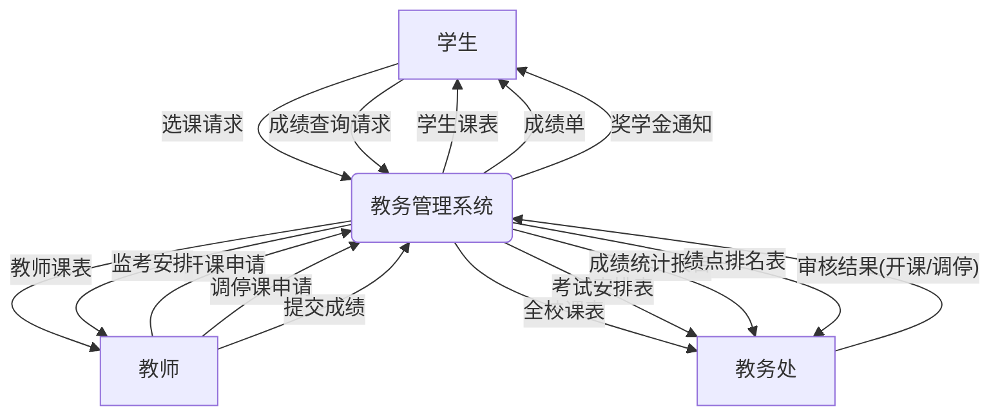
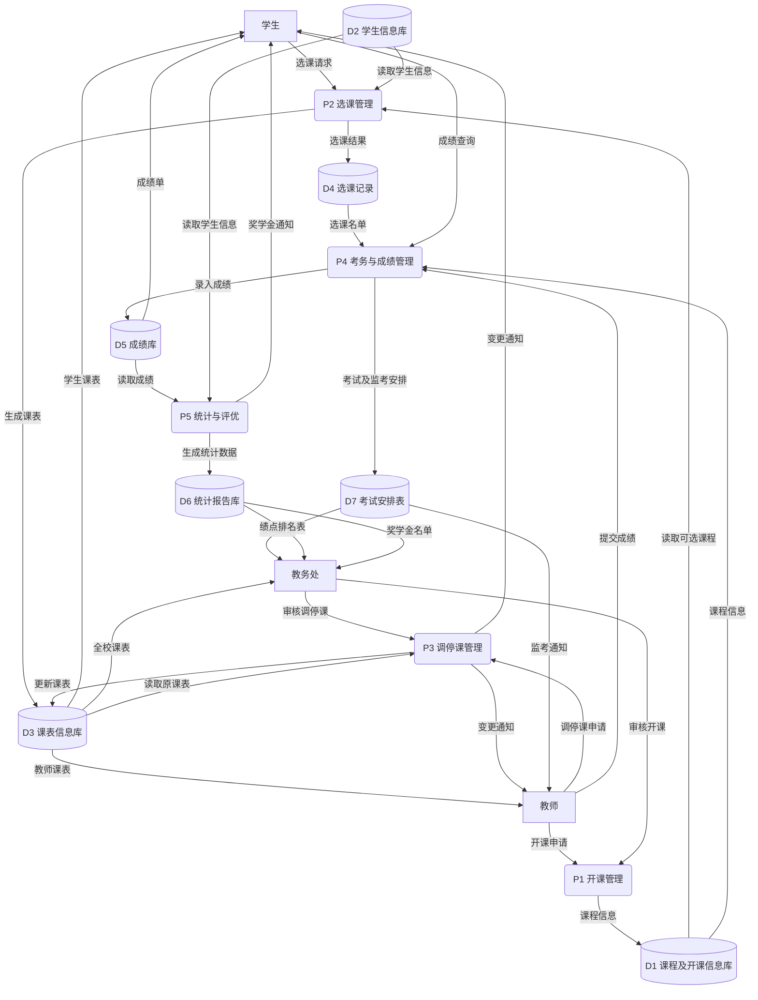
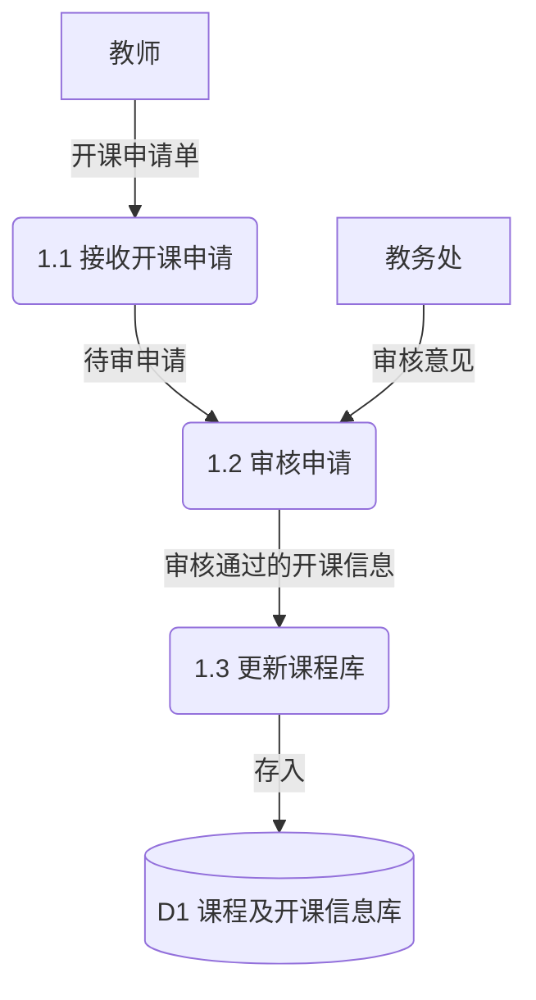
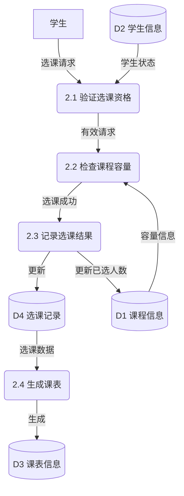
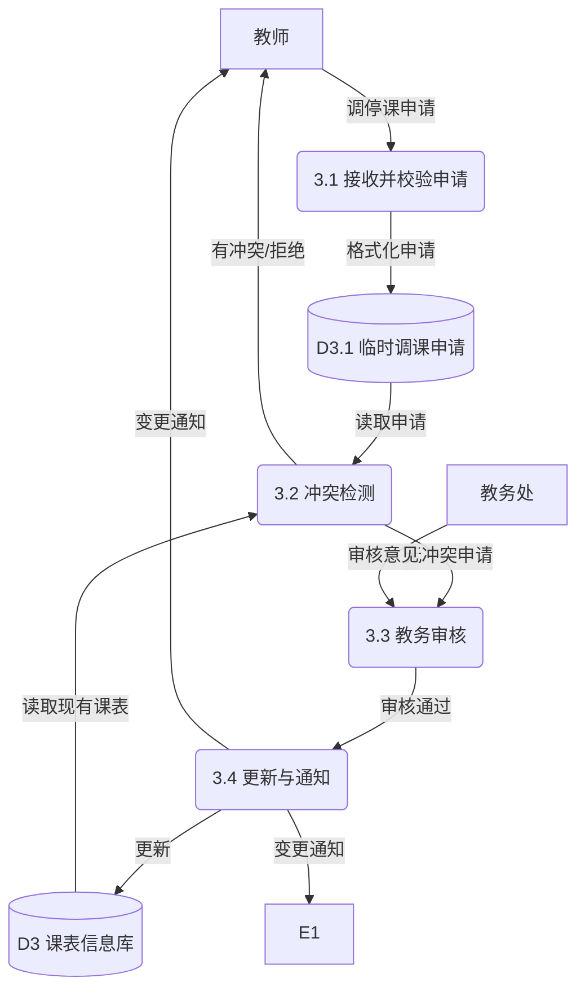
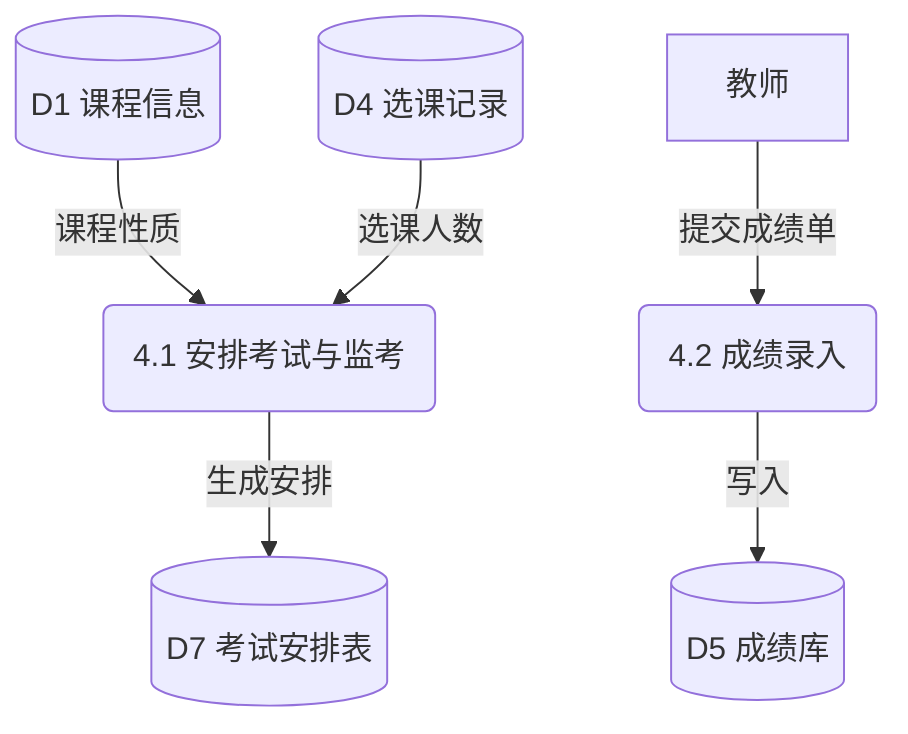
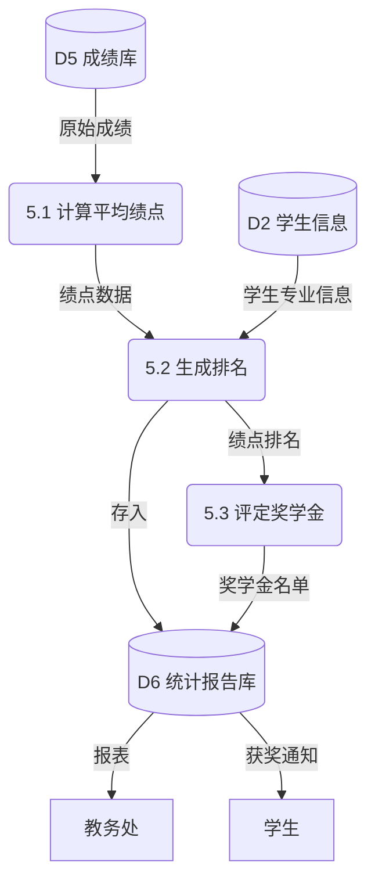

# 结构化需求分析

## 1. 系统概述
本教务管理系统旨在覆盖高校教务管理的四个主要阶段：
1.  **学期前**：教师提交开课申请，学生进行选课，系统生成教师和学生课表。
2.  **学期中**：处理教师的调课和停课申请，并更新课表。
3.  **期末**：安排考试及监考，进行成绩录入与管理。
4.  **学期结束**：统计成绩，计算绩点与排名，评定奖学金。

## 2. 数据流图 (DFD)

### 2.1 顶层图 (Context Diagram)
系统与外部实体（学生、教师、教务处）的交互。

### 2.2 0层图 (Level 0 DFD)
系统核心业务流程的分解。

### 2.3 1层图 (Level 1 DFDs)

#### P1 开课管理

#### P2 选课管理

#### P3 调停课管理
*改进点：细化为接收、检测、审核、更新四个步骤。*

#### P4 考务与成绩管理

#### P5 统计与评优 (原P6 学期总结)

---

## 3. 数据字典

### 3.1 数据项 (Data Items)
定义数据的最小单位。

| 数据项名       | 代码/别名      | 类型    | 长度  | 取值范围/格式                                                  | 说明           |
| :------------- | :------------- | :------ | :---- | :------------------------------------------------------------- | :------------- |
| **学号**       | StudentID      | Varchar | 15    | 入学年份(4)+学院(2)+专业(2)+班级(2)+序号(2) 例:202301010105 | 学生的唯一标识 |
| **教师工号**   | TeacherID      | Varchar | 10    | "T"+年份(4)+序号(5)                                            | 教师的唯一标识 |
| **课程编号**   | CourseID       | Varchar | 8     | 学院(2)+课类(2)+序号(4)                                        | 课程的唯一标识 |
| **成绩**       | Score          | Decimal | (5,1) | 0.0 - 100.0                                                    | 课程最终成绩   |
| **学期**       | Semester       | Varchar | 11    | "202x-202y-1/2"                                                | 标识学年与学期 |
| **绩点**       | GPA            | Decimal | (3,2) | 0.00 - 5.00                                                    | 平均学分绩点   |
| **周次**       | Week           | Int     | -     | 1-20                                                           | 上课周次       |
| **节次**       | Section        | Int     | -     | 1-13                                                           | 上课节次       |
| **奖学金等级** | ScholarshipLvl | Char    | 1     | 'A'(一等), 'B'(二等), 'C'(三等)                                |                |

### 3.2 数据结构 (Data Structures)
描述数据流或数据存储的逻辑组成。

*   **学生信息** = 学号 + 姓名 + 性别 + 学院代码 + 专业代码 + 班级 + 入学年份
*   **课程信息** = 课程编号 + 课程名称 + 学分 + 学时 + 开课学院 + 课程性质(必修/选修)
*   **开课申请单** = 教师工号 + 课程名称 + 建议时间(周次+星期+节次) + 建议教室类型 + 容量上限
*   **选课记录项** = 学号 + 课程编号 + 学期 + 选课时间 + 状态(已选/退选)
*   **课表项** = 课程编号 + 课程名称 + 教师姓名 + 教室 + 上课时间(周次/星期/节次)
*   **考试安排项** = 课程编号 + 考试时间 + 考试地点 + 监考教师工号 + 学生名单链接
*   **成绩单项** = 学号 + 课程编号 + 平时成绩 + 期末成绩 + 总评成绩 + 绩点
*   **奖学金记录** = 学年 + 学号 + 姓名 + 综合测评得分 + 绩点 + 排名 + 奖学金等级 + 金额

### 3.3 数据流 (Data Flows)

| 数据流名称     | 来源            | 去向          | 组成                                                               |
| :------------- | :-------------- | :------------ | :----------------------------------------------------------------- |
| **开课申请**   | E2 教师         | P1.1 接收申请 | 开课申请单                                                         |
| **选课请求**   | E1 学生         | P2.1 验证资格 | 学号 + 课程编号 + 选课操作(选/退)                                  |
| **学生课表**   | P2.4 生成课表   | E1 学生       | 学号 + 学期 + {课表项}                                             |
| **调停课申请** | E2 教师         | P3.1 接收申请 | 教师工号 + 课程编号 + 原时间 + 申请类型(调/停) + 拟调整时间 + 原因 |
| **变更通知**   | P3.4 更新与通知 | E1/E2         | 课程编号 + 变更说明 + 新时间                                       |
| **提交成绩单** | E2 教师         | P4.2 成绩录入 | 课程编号 + {学号 + 总评成绩}                                       |
| **奖学金通知** | P5.3 评定奖学金 | E1 学生       | 学号 + 姓名 + 奖学金等级                                           |

### 3.4 数据存储 (Data Stores)

| 编号   | 名称         | 组成                                 | 关键字            | 说明                                 |
| :----- | :----------- | :----------------------------------- | :---------------- | :----------------------------------- |
| **D1** | 课程及开课库 | {课程信息 + 开课状态 + 当前已选人数} | 课程编号          | 包含基础课程信息及每学期的开课动态   |
| **D2** | 学生信息库   | {学生信息}                           | 学号              |                                      |
| **D3** | 课表信息库   | {学号/教师工号 + 课表项}             | 学号/工号+学期    | 逻辑上可视图化为学生课表和教师课表   |
| **D4** | 选课记录表   | {选课记录项}                         | 学号+课程编号     | 记录每一条选课操作                   |
| **D5** | 成绩库       | {成绩单项}                           | 学号+课程编号     |                                      |
| **D6** | 统计报告库   | {绩点排名表 + 奖学金名单}            | 学期+报表类型     | 存放期末生成的静态快照数据           |
| **D7** | 考试安排表   | {考试安排项}                         | 考试批次+课程编号 | 记录考试时间地点及监考与考生对应关系 |

### 3.5 处理过程 (Processes) - 示例

*   **P3.2 冲突检测**
    *   **输入**: 调课申请(含拟调整时间), D3 课表信息(教室占用/教师时间/学生班级课表)
    *   **逻辑**:
        1. 检查拟调整时间段内，该教师是否已有课。
        2. 检查拟调整教室在该时间段是否空闲。
        3. (可选) 检查该班级学生主要时间段是否有必修课冲突。
    *   **输出**: 检测结果(通过/冲突详情)

*   **P5.3 评定奖学金**
    *   **输入**: 绩点排名(来自P5.2), 评奖规则(参数)
    *   **逻辑**:
        1. 读取全专业/全校绩点排名。
        2. 按比例(如前5%)划定一等奖学金。
        3. 按比例(如前5%-15%)划定二等奖学金。
        4. 生成奖学金名单。
    *   **输出**: 奖学金名单 -> D6, 通知 -> E1

