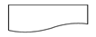
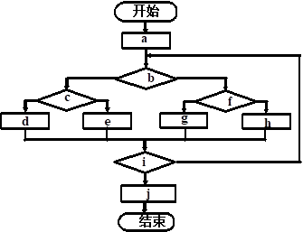
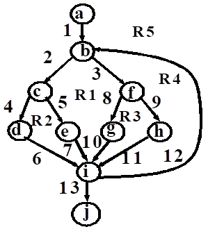
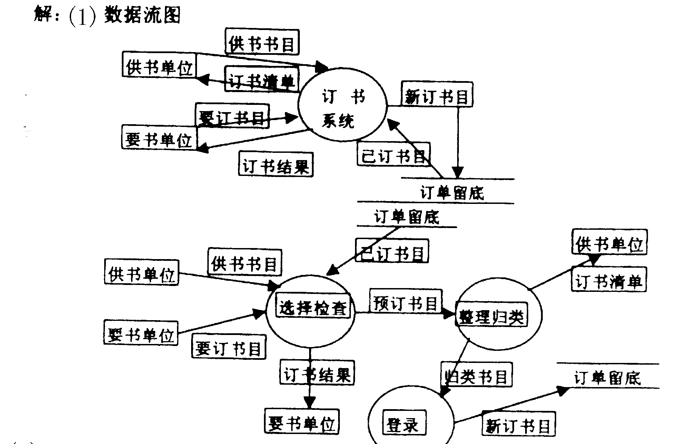
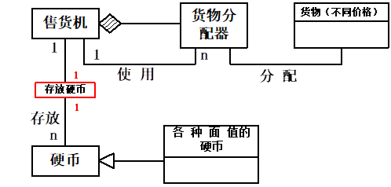
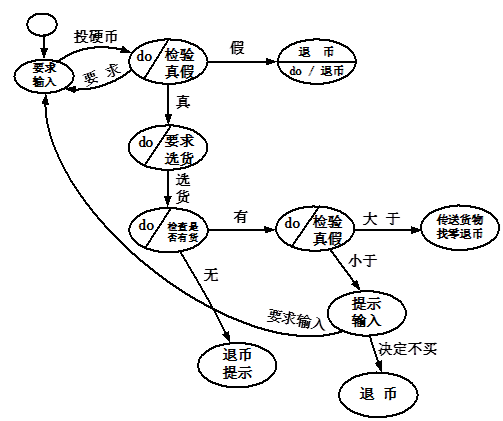

#  2010-2011学年第一学期软件工程A卷

> 考试方式：闭卷　　考试时间：120分钟　　卷面总分：100分

## 一、选择题（本题共20题，每题1分，共20分）

**1. 软件工程的基本活动是(      )。**
A. 分析、设计、实现、测试、维护      B. 沟通、设计、建模、构造、部署

C. 计划、分析、设计、实现、调试      D. 沟通、风险管理、度量、产品化、评审

**2. 需求分析的任务不包括（       ）。**

A. 问题分析      B. 系统设计      C. 需求描述      D. 需求评审。

**3. 当模块中包含复杂的条件组合，只有（     ）能够清晰地表达出各种动作之间的对应关系。**

A. 判定表和判定树      B. 盒图      C. 流程图      D. 关系图

**4. 可行性分析是在系统开发的早期所做的一项重要的论证工作，它是决定该系统是否开发的决策依据，因必须给出（     ）的回答。**

A. 确定      B. 行或不行      C. 正确      D. 无二义

**5. 结构化程序设计主要强调的是（     ）**

A. 程序的规模      B. 程序的效率      C. 程序设计语言的先进性      D. 程序易读性

---

**6. 下面哪项不是软件配置管理的目标（    ）。**

A. 标识变更      B. 控制变更      C. 软件配置审核      D. 将软件配置到用户环境中

**7. 面向对象的要素包含（　　　）**

A. 对象的唯一性      B. 抽象      C. 继承性      D. 分类性

**8. 软件成分重用不包含（      ）**

A. 代码重用      B. 分析结果重用      C. 方法和标准的重用      D. 设计结果重用

**9. 为适应软件运行环境的变化而修改软件的活动称为（    ）。**

A. 纠错性维护      B. 适应性维护      C. 改善性维护      D. 预防性维护

**10. 若有一个计算类型的程序，它的输入量只有一个X，其范围是［-1.0，1.0］，现从输入的角度考虑一组测试用例：-1.001，-1.0，1.0，1.001。设计这组测试用例的方法是(       )**

A. 条件覆盖法      B. 等价分类法      C. 边界值分析法      D. 错误推测法

---

**11. 瀑布模型的存在问题是（     ）**

A. 用户容易参与开发      B. 缺乏灵活性      C. 用户与开发者易沟通      D. 适用可变需求

**12. 测试类时使用的方法主要有。（     ）。**

A. 控制结构测试      B. 错误推测      C. 等价划分      D. 随机测试

**13. 不属于工作量估算模型的是(      )。**

A. COCOMO2模型      B. 代码行模型      C. 静态单变量模型      D. 动态多变量模型

**14. 耦合度也可以分为七级：其中最松散的耦合是（    ）。**

A. 非直接耦合      B. 数据耦合      C. 特征耦合      D. 控制耦合

**15. 程序的三种基本控制结构是（     ）**
A. 过程、子程序和分程序      B. 顺序、选择和重复

C. 递归、堆栈和队列      D. 调用、返回和转移

---

**16. 软件调试技术包括（　　　）**

A. 回溯法调试      B. 循环覆盖调试      C. 边界值分析调试      D. 集成测试调试

**17. 从事物的组成部件及每个部件的属性、功能来认识事物。这种方法被称为（    ）的方法。**

A. 面向对象      B. 面向数据      C. 面向过程      D. 面向属性

**18. 项目开发计划是什么类型的文档？（　　　）**

A. 设计性      B. 进度表示      C. 需求分析      D. 管理性

**19. 盒图也称为（   ）。这种表达方式取消了流程线，它强迫程序员以结构化方式思考和解决问题。**

A. 流程图      B. 框图      C. 判定表      D. N-S图

**20. 软件生命周期中所花费用最多的阶段是（      ）**

A. 详细设计      B. 软件编码      C. 软件测试      D. 软件维护

## 二、简答题

1、请简述一下什么是软件生命周期，它有哪6个步骤？

---

2、请用流程图描述下列程序的算法：在数组A[1]-A[10]中求最大数？

---

3、软件维护的步骤有哪些？

---

## 三、判断题（本题共10小题，每题1分，共10分）

1、一般来说，设计软件时应尽量使用数据耦合，减少控制耦合，限制外部环境耦合和公共数据耦合，杜绝内容耦合。（ ）

2、设计用户界面只需要计算机科学的理论和知识，而不一定需要认知心理学以及人-机工程学、语言学等学科的知识。（   ）

3、当程序内的分支数和循环数增加时，V（G）值将随之减少，即程序的复杂性增大。（   ）

4、软件可重用性，是指软部件可以在多种场合使用的程度。（）

5、程序中的注解越少越好。（   ）

---

6、面向对象分析强调围绕对象而不是围绕功能来构造系统。（   ）

7、经济可行性研究的范围不包括效益分析。（   ）

8、在面向对象设计阶段则着重完成“如何做”的问题，也就是着重考虑对象的实现细节。（   ）

9、基于情景的测试是面向对象系统确认测试的主要方法。（   ）

10、CMM引导软件开发机构不断识别出其软件过程的缺陷，并指出应该做哪些改进，同时也提供做这些改进的具体措施。（   ）

## 四、填空题（本题15空，每空1分，共15分）

1、在系统流程图中，代表什么含义______。

2、一个大约有5000条机器指令的程序，可能会发现______到______个错误。

3、基线就是通过了正式复审的______。

4、大型系统的对象模型通常由下述5个层次组成：______、类与对象层、______、属性层和服务层。

5、程序复杂程度定量度量方法有______和______。

---

6、大多数系统的面向对象设计模型，在逻辑上都由4大部分组成。它们组成了目标系统的4个子系统，分别是：问题于子系统、______、______、数据管理子系统。

7、面向对象的测试策略与传统的软件测试不同，测试的焦点从______移向了对象类。

8、在面向对象设计时，子系统之间存在着两种交互方式，分别是客户-供应商关系和______。

9、在维护过程中，改正性维护的大概比例是。

10、在面向对象方法中，对象使______和______封装于对象的统一体中。

## 五、简答题（本题共5小题，共25分）

1、为什么说软件需求是决定软件开发是否成功的一个关键因素？（5分）

> 需求分析可以帮助开发人员真正理解业务问题
>
> 需求分析是估算成本和进度的基础
>
> 需求分析可以避免建造错误的系统，从而减少不必要的浪费
>
> 软件规格说明有助于开发人员与客户在“系统应该做什么”问题上达成正式契约
>
> 需求分析形成了软件开发的基线，有助于管理软件的演化和变更–软件需求是软件质量的基础，为系统验收测试提供了标准

---

2、什么是黑盒测试？什么是白盒测试？（5分）

> 黑盒测试法把程序看作一个黑盒子，完全不考虑程序的内部结构和处理过程。它只检查程序功能是否能按照SRS规定正常使用，程序是否能适当地接收输入数据并产生正确的输出信息，又称为功能测试。
>
> 白盒测试法：把程序看成装在一个透明的白盒子里，测试者完全知道程序的结构和处理算法。这种方法按照程序内部的逻辑测试程序，检测程序中的主要执行通路是否都能按预定要求正确工作。又称为结构测试。

---

3、怎样从需求分析阶段的数据流图DFD产生概要设计说明书或模块说明书？（5分）

> 第1步：精化DFD；
>
> 第2步：确定DFD的类型（分为变换型和事务型两类）；
>
> 第3步：分解上层模块，设计中下层模块结构；
>
> 第4步：根据优化准则对软件结构求精。
>
> 第5步：描述模块功能、接口及全局数据结构；
>
> 第6步：复查，如果有错，转向第2步修改完善，无错则进入详细设计。

---

4、什么是软件工程？什么是软件过程？（5分）

> 定义1：为了经济地获得可靠的且能在实际机器上有效地运行的软件，而建立和使用完善的工程原理。
>
> 定义2：软件工程是用科学知识和技术原理来定义、开发维护软件的一门科学。其主要思想是用工程的方法代替传统手工方法。这种工程化的思想贯穿到需求分析，设计，实现，直到维护的整个这程。
>
> 定义3：是研究和应用如何以系统性，规范化，可定量的方法去开发，操纵和维护软件，即把工程实践应用到软件上。
>
> 1993年IEEE软件工程定义:软件工程是(1)将系统化的、严格约束的、可量化的方法应用于软件的开发、运行和维护，即将工程化应用于软件。(2)在(1)中所述方法的研究。
>
> 软件过程是为了获得高质量软件所需要完成的一系列任务的框架，它规定了完成各项任务的工作步骤。描述了who、when、what、how，用以实现某一个特定的具体目标。定义了运用方法的顺序、应该交付的文档资料、管理措施和标识软件开发各个阶段任务完成的里程碑。

---

5、画出与图1所示的程序流程图对应的流图（程序图），并试计算其环形复杂度V(G)。（5分）

> （1）程序图（图形结构一样就可以）
>
> 
>
> （2）计算其巡回秩数：V（G）=E –N +2=13 –10 +2=5

---

## 六、综合题（本题共3小题，共30分）

1、图书馆的预定图书子系统有如下功能：由供书部门提供书目给订购组；订书组从各单位取得要订的书目；根据供书目录和订书书目产生订书文档留底；将订书信息（包括数目，数量等）反馈给供书单位；将未订书目通知订书者；对于重复订购的书目由系统自动检查，并把结果反馈给订书者。试根据要求画出该问题的分层数据流图。 (本小题8分)

> 

---

2、下面是自动售货机系统的需求陈述，要求建立它的对象模型和动态模型。(本小题16分)

自动售货机系统是一种无人售货系统。售货时，顾客把硬币投入机器的投币口，机器检查硬币的大小、重量、厚度以及边缘类型。有效的硬币是一元、五角、一角。其它货币是无效货币。机器不接收无效货币，并从退币口退出。机器接受了有效硬币后，把硬币送人硬币存储器。顾客投入的货币总额被累加起来。

自动售货机有货物分配器。每个货物分配器中包括零个或多个价格相同的货物。顾客通过选择货物分配器来选择货物。如果货物分配器中有货物，而且顾客支付的货币总额大于等于该货物价格，货物被送到货物传送孔给顾客，并从退币口退还相应的零钱。如果货物分配器是空的，则从退币口退还等额的硬币。如果顾客支付的货币总额不足，机器等待顾客投入更多硬币。如果顾客放弃购买，他投入的硬币从退币口退出。

> 
> 

---

3、根据你课程实践的经验，论述你参与分析和开发的项目概要（需求分析和设计的重点内容）和你所担任的工作（你工作的重点内容）。（本小题6分）

> 参考答案略

---

## 参考答案

一、选择题（本题共20题，每题1分，共20分）

A B  A  B  D  D  B  C  B  C

B D  B  A  B  A  A  D  D  D

1、请简述一下什么是软件生命周期，它有哪6个步骤？

2、请用流程图描述下列程序的算法：在数组A[1]-A[10]中求最大数？

3、软件维护的步骤有哪些？

二、判断题（本题共10小题，每题1分，共10分）

（√）（ X）（X）(√)（ X ）（ √  ）（ X  ）（√ ）（√ ）（ X ）

三、填空题（本题15空，每空1分，共15分）（只要与答案内容接近都按正确对待）

1. 文档　　　
2. 25 、  100
3. 软件配置项
4.

主题层、结构层

5. McCabe方法(或环形复杂度)、Halstead方法

6.人机交互管理子系统、任务管理子系统（或控制子系统）

7.过程构件

8. 平等伙伴关系
9. 17%～21%   。（在这个范围内都对）
10. 数据  、  操作

四、简答题（本题共5小题，共25分）（答案与问题沾边至少给2分，越接近标准答案，分数越高）

1、答：

需求分析可以帮助开发人员真正理解业务问题            （1分）

需求分析是估算成本和进度的基础                      （1分）

需求分析可以避免建造错误的系统，从而减少不必要的浪费   （1分）

软件规格说明有助于开发人员与客户在“系统应该做什么”问题上达成正式契约                           （1分）

需求分析形成了软件开发的基线，有助于管理软件的演化和变更–软件需求是软件质量的基础，为系统验收测试提供了标准  （1分）

2.答（5分）

黑盒测试法把程序看作一个黑盒子，完全不考虑程序的内部结构和处理过程。它只检查程序功能是否能按照SRS规定正常使用，程序是否能适当地接收输入数据并产生正确的输出信息，又称为功能测试。

白盒测试法：把程序看成装在一个透明的白盒子里，测试者完全知道程序的结构和处理算法。这种方法按照程序内部的逻辑测试程序，检测程序中的主要执行通路是否都能按预定要求正确工作。又称为结构测试。

3. 答：（5分）

第1步：精化DFD；

第2步：确定DFD的类型（分为变换型和事务型两类）；

第3步：分解上层模块，设计中下层模块结构；

第4步：根据优化准则对软件结构求精。

第5步：描述模块功能、接口及全局数据结构；

第6步：复查，如果有错，转向第2步修改完善，无错则进入详细设计。

4.什么是软件工程？什么是软件过程？（5分）

定义1：为了经济地获得可靠的且能在实际机器上有效地运行的软件，而建立和使用完善的工程原理。

定义2：软件工程是用科学知识和技术原理来定义、开发维护软件的一门科学。其主要思想是用工程的方法代替传统手工方法。这种工程化的思想贯穿到需求分析，设计，实现，直到维护的整个这程。

定义3：是研究和应用如何以系统性，规范化，可定量的方法去开发，操纵和维护软件，即把工程实践应用到软件上。

1993年IEEE软件工程定义:软件工程是(1)将系统化的、严格约束的、可量化的方法应用于软件的开发、运行和维护，即将工程化应用于软件。(2)在(1)中所述方法的研究。

软件过程是为了获得高质量软件所需要完成的一系列任务的框架，它规定了完成各项任务的工作步骤。描述了who、when、what、how，用以实现某一个特定的具体目标。定义了运用方法的顺序、应该交付的文档资料、管理措施和标识软件开发各个阶段任务完成的里程碑。

5.（5分）解：（1）程序图（图形结构一样就可以）

（2）计算其巡回秩数：V（G）=E –N +2=13 –10 +2=5

五、综合题（本题共3小题，共30分）

2. (本小题16分)
   
   

3.根据你课程实践的经验，论述你参与分析和开发的项目概要（需求分析和设计的重点内容）和你所担任的工作（你工作的重点内容）。（本小题6分）
