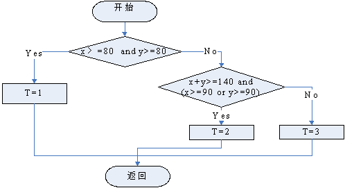
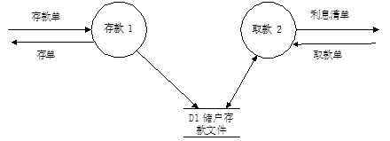
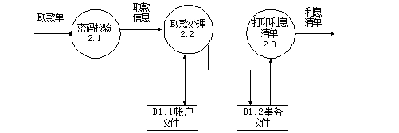
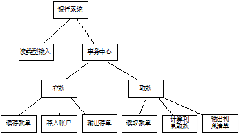
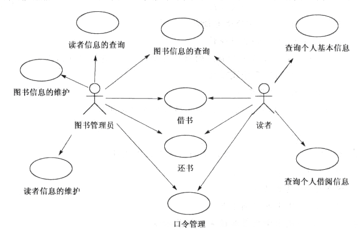
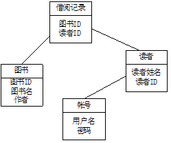

# 2010-2011学年第一学期软件工程B卷

> 考试方式：闭卷　　考试时间：120分钟　　卷面总分：100分

## 一、选择题（本题共20题，每题1分，共20分）

**1. 软件工程的基本活动是(     )。**
A. 分析、设计、实现、测试、维护      B. 沟通、设计、建模、构造、部署

C. 计划、分析、设计、实现、调试      D. 沟通、风险管理、度量、产品化、评审

**2. 开发软件所需高成本和产品的低质量之间有着尖锐的矛盾,这种现象称(    )。**

A. 软件工程      B. 软件周期      C. 软件危机      D. 软件产生

**3. 基线是指在项目生命周期的不同时间点上，一个或一组配置项通过（   ）而进入正式受控的一种状态。**

A. 存取控制      B. 质量控制      C. 正式评审      D. 变更管理

**4. 可行性研究要进行一次(     )需求分析。**

A. 详细的      B. 全面的      C. 简化的、压缩的      D. 彻底的

**5. 总体设计目的是确定整个系统的（    ）。**

A. 规模      B. 测试方案      C. 费用      D. 功能及模块结构

---

**6. 下面哪项不是软件配置管理的目标（   ）。**

A. 标识变更      B. 控制变更      C. 软件配置审核      D. 将软件配置到用户环境中

**7. 下列哪个不属于UML动态视图（    ）。**

A. 状态图      B. 协作图      C. 配置图      D. 顺序图

**8. 在划分软件模块时应当注意保持模块的独立性，并要（   ）。**

A. 高内聚高耦合      B. 高内聚低耦合      C. 低内聚高耦合      D. 低内聚低耦合

**9. 为了提高软件的可维护性，在编码阶段应注意（      ）**

A. 保存测试用例和数据      B. 提高模块的独立性

C. 文档的副作用      D. 养成好的程序设计风格

**10. 软件详细设计的主要任务是确定每个模块的(    )。**

A. 算法和使用的数据结构      B. 外部接口      C. 功能      D. 编程

---

**11. 快速原型模型的主要特点之一是(      )。**
A. 开发完毕才见到产品      B. 及早提供全部完整的软件产品

C. 开发完毕后才见到工作软件      D. 及早提供部分软件产品

**12. 软件测试的目标是（   ）。**
A. 证明软件是正确的      B. 发现错误、降低错误带来的风险

C. 排除软件中所有的错误      D. 与软件调试相同

**13. 采用Gantt图表示软件项目进度安排，下列说法中正确的是(     )。**
A. 能够反映多个任务之间的复杂关系      B. 能够直观表示任务之间相互依赖制约关系

C. 能够表示哪些任务是关键任务      D. 能够表示子任务之间的并行和串行关系

**14. 为了提高模块的独立性，模块内部最好是（    ）。**

A. 逻辑内聚      B. 时间内聚      C. 功能内聚      D. 通信内聚

**15. 软件维护产生的副作用，是指（  ）。**

A. 开发时的错误      B. 隐含的错误

C. 因修改软件而造成的错误      D. 运行时误操作

---

**16. 软件开发时，一个错误发现得越晚，为改正它所付出的代价就（   ）。**

A. 越大      B. 越小      C. 越不可捉摸      D. 越接近平均水平

**17. 类的行为应该基于（  ）进行测试。**

A. 数据流图      B. 对象图      C. 状态图      D. 用例图

**18. 软件项目规划的第一步是（  ）。**

A. 确定项目预算      B. 选择团队的组织模型

C. 确定项目的约束      D. 建立项目的目标和范围

**19. 功能点估算技术需要以（   ）为基础进行问题分解。**

A. 信息域      B. 项目进度      C. 软件功能      D. 过程活动

**20. 在需求开发过程中，软件工程师应与客户合作共同定义（   ）。**

A. 客户可见的使用场景      B. 重要的软件特性      C. 系统的输入与输出

D. 选项A和B      E. 选项A、B和C

## 二、简答题

1、请简述一下什么是软件生命周期，它有哪6个步骤？

---

2、请用流程图描述下列程序的算法：在数组A[1]-A[10]中求最大数？

---

3、软件维护的步骤有哪些？

---

## 三、判断题（本题共10小题，每题1分，共10分）

1、需求是变化的，软件是灵活的，总可以满足需求。（    ）

2、因为面向对象程序设计模式解决了抽象和重用，所以成为了当今的主流模式。（　）

3、模块的内聚程度最高的是功能内聚。（   ）

4、好的测试是用少量的测试用例运行程序，发现被测程序尽可能多的错误。（   ）

5、如果利用快速原型法进行开发，那么就不必进行需求分析。（   ）

---

6、度量程序复杂程度的目的是对该程序测试难度的一种估计。（   ）

7、解决软件危机的途径是按工程化的原则和方法进行软件开发。（   ）

8、一段可以运行的程序称之为软件。（   ）

9、面向对象的集成测试重点在于发现不同类之间的协作错误。 （　 ）

10、CMM能力成熟度模型只关注软件过程，不关注软件开发技术和人员问题，说明开发技术和人员问题并不重要。（　 ）

## 四、填空题（本题15空，每空1分，共15分）

1、可行性研究主要研究系统的          、        和操作可行性。

2、需求开发的内容包括：需求获取、       、规格说明、需求验证。

3、面向对象开发方法的基础构件是            。

4、软件工程包括三个要素：           、           、           。

5、结构化分析方法使用数据流图（DFD）和        来描述。

---

6、软件生命周期中所花费用最多的阶段是_____________。

7、大多数系统的面向对象设计模型，在逻辑上都由4大部分组成。它们组成了目标系统的4个子系统，分别是：_____________、人机交互管理子系统、任务管理子系统、_____________。

8、面向对象的测试策略与传统的软件测试不同，测试的焦点从过程构件（模块）移向了____________。

9、在面向对象设计时，子系统之间存在着两种交互方式，分别是_____________和平等伙伴关系。

10、根据维护的目的不同，把软件维护分为改正性维护、完善性维护、____________和预防性维护。

---

11、 在面向对象方法中，对象实现了数据和操作的结合，使数据和操作____________于对象的统一体中。

## 五、简答题（本题共5小题，共25分）

1、简述软件配置管理的目标和基线的含义。（5分）

> 配置管理的含义：配置管理是一组管理整个软件生存期个阶段中变更的活动，标识变更、控制变更、确保变更能正确的实现、并报告有关变更情况，使变更所产生的错误最小并最有效地提高生产率。
>
> 基线的含义：基线是通过了正式复审的软件配置项，是软件生存期中各开发阶段的一个特定的检查点，使各阶段工作划分更加明确化。能够保证当基线发生错误时，可以知道其所处的位置，并返回到最近和最恰当的基线上。

---

2、论述面向对象方法学中三类模型（对象模型、动态模型、功能模型）之间的关系。（5分）

> 三种模型都包含了同样的概念、数据、序列和操作，但他们描述了系统的不同方面，同时也互相引用。
>
> 对象模型描述了动态模型和功能模型所操作的数据结构，对象模型中的操作对应于动态模型中事件和功能模型中的函数；动态模型描述了对象模型的控制结构，告诉我们哪些决策是依赖于对象值，哪些引起对象的变化，并激活功能；功能模型描述了由对象模型中操作和动态模型中动作所激活的功能，而功能模型作用在对象模型说明的数据上，同时还表示了对对象值的约束。

---

3、软件生命周期主要包括哪些阶段？请简要说明各阶段的主要任务。

> 软件生命周期一般包括分析、设计、实现、测试、维护等阶段。
>
> 分析阶段：分析、整理和提炼所收集到的用户需求，建立完整的分析模型，将其编写 成软件需求规格说明和初步的用户手册。
>
> 设计阶段：设计人员依据软件需求规格说明文档，确定软件的体系结构，进而确定每 个模块的实现算法、数据结构和接口等，编写设计说明书，并组织进行设计评审。
>
> 实现阶段：将所设计的各个模块编写成计算机可接受的程序代码，与实现相关的文档就是源程序以及合适的注释。
>
> 测试阶段：在设计测试用例的基础上，测试软件的各个组成模块。然后，将各个模块 集成起来，测试整个产品的功能和性能是否满足已有的规格说明。
>
> 维护阶段：为了改正错误、适应环境变化和增强功能，对软件进行一系列的修订。

---

4、根据课程实践，简述需求分析的重要性和文档在软件工程中的作用。

> ① 提高软件开发过程的能见度。②提高开发效率。③作为开发人员阶段工作成 果和结束标志。④记录开发过程的有关信息，便于使用与维护。⑤提供软件运行、维护和培训有关资料。⑥便于用户了解软件功能、性能。

---

5、阅读下列说明和流程图，如下图所示，回答问题。（5分）

**说明：** 本流程图描述了某子程序的处理流程，现要求用**白盒测试法**对其进行测试.

**问题：** 根据判定覆盖、条件覆盖、路径覆盖的覆盖标准，从供选择的答案中分别找出满足相应覆盖标准的最小的测试数据组。（用1~10回答）。供选择的答案如下：

| **1** | **x=90,y=90**                                                                                | **2**  | **x=50,y=50**                                                                                |
| ----------- | -------------------------------------------------------------------------------------------- | ------------ | -------------------------------------------------------------------------------------------- |
| **3** | **x=90,y=90; x=50,y=50**                                                                     | **4**  | **x=90,y=70; x=40,y=90**                                                                     |
| **5** | **x=90,y=90; x=50,y=50;** **x=90,y=70;**                                                     | **6**  | **x=90,y=70; x=70,y=90;** **x=50,y=50;**                                                     |
| **7** | **x=90,y=90; x=50,y=50;** **x=90,y=70; x=70,y=90;**                                          | **8**  | **x=90,y=90; x=50,y=50;** **x=90,y=50; x=80,y=80;**                                          |
| **9** | **x=90,y=90; x=90,y=70;** **x=90,y=30; x=70,y=90;** **x=30,y=90, x=70,y=70;** **x=50,y=50;** | **10** | **x=90,y=90; x=80,y=80;** **x=90,y=70; x=70,y=90;** **x=30,y=90; x=70,y=70;** **x=50,y=50;** |

> 判定覆盖：5  （1分）
>
> 条件覆盖：4  （2分）
>
> 路径覆盖：5  （2分）

---

## 六、综合题（本题共3小题，共30分）

1、为方便储户，某银行拟开发计算机储蓄系统。储户填写的存款单或取款单由业务员键入系统，如果是存款，系统记录存款人姓名、住址、存款类型、存款日期、利率等信息，并印出存款单给储户；如果是取款，系统计算利息并印出利息清单给储户。(本小题10分)

（1）请用分层数据流图的方法描绘本系统的功能。

（2）用面向数据流的方法设计系统的结构。

> (1)
>
> 
> 
> 
> 
>
> (2)
>
> 

---

2、“图书管理系统”主要提供图书信息、读者基本信息以及借阅等功能，方便整个系统管理和学生借阅图书。（本小题12分）

用户需求陈述如下。

（1）能够存储一定数量的图书信息、并方便有效地进行相应的数据操作和管理。功能包括：图书信息的录入、删除及修改；图书信息的多关键字检索查询；图书的借出；图书的返还。

（2）能够对一定数量的读者进行相应的信息操作与管理。功能包括：读者信息的登记、删除及修改；读者资料的统计查询；能够提供一定的安全机制，提供数据信息授权访问。

（3）该系统的用户是：图书管理员和读者。

图书管理员进行图书基本信息的维护；图书基本信息的查询；读者基本信息的维护；读者基本信息的查询；借阅图书；归还图书功能。

读者可以查阅图书的基本信息；借阅图书；归还图书；查阅个人基本信息；查阅个人借阅信息。

（4）补充说明：

需要长期保存的数据有：图书的基本信息、读者的基本信息、图书的借阅信息、帐号信息。

问题：（1）画出该“图书管理系统”的用例图；

（2）画出该“图书管理系统”分析阶段的类图；

> （1）用例图
>
> 
>
> （2）类图
>
> 

---

3、根据你课程实践的经验，论述你参与分析和开发的项目概要（需求分析和设计的重点内容）和你所担任的工作（你工作的重点内容）。（本小题8分）

> 参考答案略

---

## 参考答案

一、选择题（本题共20题，每题1分，共20分）

1-5 .ACCCD      6-10 DCBDA

11-15.DBDCC      16-20 ACDAE

二、判断题（本题共10小题，每题1分，共10分）

1—5：×、√、√、√、×

6—10：√、√、×、√、×

三、填空题（本题15空，每空1分，共15分）

1.经济可行性、技术可行性

2.需求分析

3.对象和类

4.过程、工具和方法

5.数据字典

6.软件维护

7.问题域子系统、数据管理子系统

8.对象或类

9.客户供应商关系

10.适应性维护

11. 封装

四、简答题（本题共5小题，共25分）

1.答：配置管理的含义：配置管理是一组管理整个软件生存期各阶段中变更的活动，标识变更、控制变更、确保变更能正确的实现、并报告有关变更情况，使变更所产生的错误最小并最有效地提高生产率。

基线的含义：基线是通过了正式复审的软件配置项，是软件生存期中各开发阶段的一个特定的检查点，使各阶段工作划分更加明确化。能够保证当基线发生错误时，可以知道其所处的位置，并返回到最近和最恰当的基线上。

2. 答： 三种模型都包含了同样的概念、数据、序列和操作，但他们描述了系统的不同方面，同时也互相引用。

对象模型描述了动态模型和功能模型所操作的数据结构，对象模型中的操作对应于动态模型中事件和功能模型中的函数；动态模型描述了对象模型的控制结构，告诉我们哪些决策是依赖于对象值，哪些引起对象的变化，并激活功能；功能模型描述了由对象模型中操作和动态模型中动作所激活的功能，而功能模型作用在对象模型说明的数据上，同时还表示了对对象值的约束。

 3.答：软件生命周期一般包括分析、设计、实现、测试、维护等阶段。

  分析阶段：分析、整理和提炼所收集到的用户需求，建立完整的分析模型，将其编写 成软件需求规格说明和初步的用户手册。

  设计阶段：设计人员依据软件需求规格说明文档，确定软件的体系结构，进而确定每 个模块的实现算法、数据结构和接口等，编写设计说明书，并组织进行设计评审。

  实现阶段：将所设计的各个模块编写成计算机可接受的程序代码，与实现相关的文档就是源程序以及合适的注释。

  测试阶段：在设计测试用例的基础上，测试软件的各个组成模块。然后，将各个模块 集成起来，测试整个产品的功能和性能是否满足已有的规格说明。

  维护阶段：为了改正错误、适应环境变化和增强功能，对软件进行一系列的修订。

4.答：① 提高软件开发过程的能见度。②提高开发效率。③作为开发人员阶段工作成 果和结束标志。④记录开发过程的有关信息，便于使用与维护。⑤提供软件运行、维护和培训有关资料。⑥便于用户了解软件功能、性能。

5. 答：判定覆盖：5  （1分）

 条件覆盖：4  （2分）

  路径覆盖：5  （2分）

五、综合题（本题共3小题，共30分）

1. 参考答案

(1)

(2)

2．参考答案（12分）

（1）用例图

（2）类图

3、参考答案略（8分）
