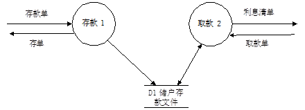
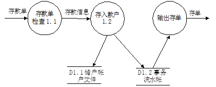
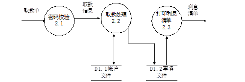
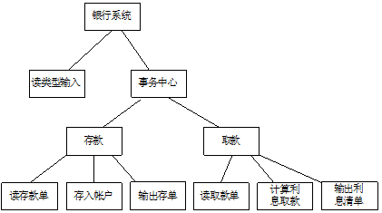

# 2011-2012学年第一学期软件工程A卷

> 考试方式：闭卷　　考试时间：120分钟　　卷面总分：100分

## 一、选择题（本题共15题，每题2分，共30分）

**1. 程序的三种基本控制结构是（    ）。**
A. 过程、子程序和分程序      B. 顺序、选择和循环

C. 递归、堆栈和队列      D. 调用、返回和转移

**2. 在软件开发模型中，提出最早、应用最广泛的模型是（　   ）。**
A. 瀑布模型      B. 螺旋模型      C. 增量模型      D. 喷泉模型

**3. （     ）是把对象的属性和操作结合在一起，构成一个独立的对象，其内部信息对外界是隐蔽的，外界只能通过有限的接口与对象发生联系。**
A. 多态性      B. 继承      C. 封装      D. 消息

**4. 总体设计的目的是确定整个系统的（    ）。**
A. 规模      B. 测试方案      C. 费用      D. 功能及模块结构

**5. 模块的内聚性最高的是（    ）。**
A. 逻辑内聚      B. 时间内聚      C. 偶然内聚      D. 功能内聚

---

**6. 若有一个计算类型的程序，它的输入量只有一个X，其范围是［-1.0，1.0］，现从输入的角度考虑一组测试用例：-1.001，-1.0，1.0，1.001。设计这组测试用例的方法是（     ）。**
A. 条件覆盖法      B. 等价分类法      C. 边界值分析法      D. 错误推测法

**7. 面向对象分析是对系统进行（　   ）的一种方法。**
A. 需求建模      B. 程序设计      C. 设计评审      D. 测试验收

**8. 因计算机硬件和软件环境的变化而作出的修改软件的过程称为( 　　 )。**
A. 校正性维护      B. 适应性维护      C. 完善性维护      D. 预防性维护

**9. 软件生命周期中所花费用最多的阶段是( 　　 )。**
A. 详细设计      B. 软件编码      C. 软件测试      D. 软件维护

**10. 下列属于维护阶段的文档是 (     )。**
A. 软件规格说明      B. 用户操作手册      C. 软件问题报告      D. 软件测试分析报告

---

**11. 下列模型属于成本估算方法的有(     )。**
A. COCOMO模型      B. McCall模型      C. McCabe度量法      D. 时间估算法

**12. 软件按照设计的要求，在规定时间和条件下达到不出故障、持续运行的要求的质量特性称为(   )。**
A. 可用性      B. 可靠性      C. 正确性      D. 完整性

**13. 对象是OO方法的核心，对象的类型有多种，通常把例如飞行、事故、演出、开会等等，称之为(     )。**
A. 有形实体      B. 作用      C. 事件      D. 性能说明

**14. 研究开发所需要的成本和资源是属于可行性研究中的 (      )。**
A. 技术可行性      B. 经济可行性      C. 社会可行性      D. 法律可行性

**15. 软件详细设计主要采用的方法是(      )。**
A. 模块设计      B. 结构化设计      C. PDL语言      D. 结构化程序设计

## 二、简答题

1、请简述一下什么是软件生命周期，它有哪6个步骤？

---

2、请用流程图描述下列程序的算法：在数组A[1]-A[10]中求最大数？

---

3、软件维护的步骤有哪些？

---

## 三、判断题（本题共10小题，每题1分，共10分）

1、软件维护就是改正软件中的错误。（     ）

2、如果测试人员在一段程序的测试中没有发现错误，说明这段程序的可靠性就好。（     ）

3、软件需求分析的任务是建立软件模块结构图。（     ）

4、在CMM的级别认证中，如果某一个级别的大多数关键过程域都已经实现，只有一个关键过程域或个别关键实践没有实现，也可以认为已达到了该级别的认证。（　   ）

5、数据流图与程序流程图的主要区别是程序流程图中各处理框之间有严格的时间上的顺序。而数据流图只反映数据的流向，不反映处理逻辑的先后。（　   ）

---

6、快速原型法是在原型基础上逐渐完成整个系统的开发工作。（　   ）

7、与确认测试阶段有关的文档是概要设计说明书。（　   ）

8、使用好的开发工具可以降低开发成本。（　   ）

9、面向对象的集成测试重点在于发现不同类之间的协作错误。（　   ）

10、需求分析报告只有软件分析人员能看懂。（　   ）

## 四、填空题（本题共10空，每空2分，共20分）

1、单元测试过程应为测试模块开发一个　   　　和(或)若干个　   　　。

2、软件由程序、　   　　、　　  　　组成。

3、一个学生可以选修多门课程，一门课程可以由多个学生选修，那么学生和课程之间是　　  　关联。

4、一个模块拥有的直属下级模块的个数称为           ，一个模块的直接上级模块的个数称为           。

5、将数据流图映射为程序结构时, 所用映射方法涉及信息流的类型。其信息流分为       和      两种类型。

---

6、类A的一个操作调用类B的一个操作，且这两个类之间不存在其他关系，那么类A和类B之间是   　关系。

## 五、简答题（本题共4小题，共20分）

1、软件生命周期主要包括哪些阶段？请简要说明各阶段的主要任务。（5分）

> 答：软件生命周期一般包括分析、设计、实现、测试、维护等阶段。
>
> 分析阶段：分析、整理和提炼所收集到的用户需求，建立完整的分析模型，将其编写 成软件需求规格说明和初步的用户手册。
>
> 设计阶段：设计人员依据软件需求规格说明文档，确定软件的体系结构，进而确定每 个模块的实现算法、数据结构和接口等，编写设计说明书，并组织进行设计评审。
>
> 实现阶段：将所设计的各个模块编写成计算机可接受的程序代码，与实现相关的文档就是源程序以及合适的注释。
>
> 测试阶段：在设计测试用例的基础上，测试软件的各个组成模块。然后，将各个模块 集成起来，测试整个产品的功能和性能是否满足已有的规格说明。
>
> 维护阶段：为了改正错误、适应环境变化和增强功能，对软件进行一系列的修订。

---

2、比较面向对象开发方法与结构化开发方法的异同。（5分）

> 答：结构化方法的最大特点是面向功能分解问题。但由于处理与数据是分离的，并且在设计阶段与分析阶段采用不同的模型。优点是：简单、实用，适合于瀑布模型，易于为开发者掌握，特别适合于数据处理领域中的应用。缺点是：对于规模大、复杂的项目不太适应；难以解决软件重用，难于适应需求变化，难以解决维护问题。
>
> 面向对象方法以最稳定的对象与类系统作为考虑问题的出发点，通过不断反复、累增，逐步改进系统，从而更易获得符合用户需求、简单可靠、适应性强的系统。面向对象方法强调对象结构，而不是程序结构，从而解决了抽象和重用问题，成为当今的主流模式。

---

3、什么是黑盒测试？什么是白盒测试？（5分）

> 答：黑盒测试法把程序看作一个黑盒子，完全不考虑程序的内部结构和处理过程。它只检查程序功能是否能按照SRS规定正常使用，程序是否能适当地接收输入数据并产生正确的输出信息，又称为功能测试。
>
> 白盒测试法：把程序看成装在一个透明的白盒子里，测试者完全知道程序的结构和处理算法。这种方法按照程序内部的逻辑测试程序，检测程序中的主要执行通路是否都能按预定要求正确工作。又称为结构测试。

---

4、试述软件概要设计过程中应遵循的基本原理。（5分）

> 答：模块化、抽象、逐步求精、信息隐藏和局部化、模块独立。

---

## 六、综合题（本题共2小题，共20分）

1、为方便储户，某银行拟开发计算机储蓄系统。储户填写的存款单或取款单由业务员键入系统，如果是存款，系统记录存款人姓名、住址、存款类型、存款日期、利率等信息，并印出存款单给储户；如果是取款，系统计算利息并印出利息清单给储户。(本题12分)

（1）请用分层数据流图的方法描绘本系统的功能。(6分)

（2）用面向数据流的方法设计系统的结构。(6分)

> (1)
>
> 
> 
> 
> 
>
> (2)
>
> 

---

2、根据你课程实践的经验，论述你参与分析和开发的项目概要和你所担任的工作（本题8分）。

> 无统一答案，酌情给分。

---

## 参考答案

### 一、单项选择题（本题共15题，每题2分，共30分）

1、B     2、A     3、C     4、D     5、D

6、C     7、A     8、B     9、D     10、C

11、A    12、B    13、C    14、B    15、D

### 二、判断题（本题共10小题，每题1分，共10分）

1—5：×、×、×、×、√

6—10：√、×、×、√、×

### 三、填空题（本题共10空，每空2分，共20分）

1、驱动模块（程序），存根模块（程序）；

2、数据， 文档

3、多对多；

4、模块的扇出，模块的扇入

5、事物流，变换流

6、依赖

### 四、简答题（本题共4小题，共20分,答对要点即得分）

1、答：软件生命周期一般包括分析、设计、实现、测试、维护等阶段。

    分析阶段：分析、整理和提炼所收集到的用户需求，建立完整的分析模型，将其编写 成软件需求规格说明和初步的用户手册。

    设计阶段：设计人员依据软件需求规格说明文档，确定软件的体系结构，进而确定每 个模块的实现算法、数据结构和接口等，编写设计说明书，并组织进行设计评审。

    实现阶段：将所设计的各个模块编写成计算机可接受的程序代码，与实现相关的文档就是源程序以及合适的注释。

    测试阶段：在设计测试用例的基础上，测试软件的各个组成模块。然后，将各个模块 集成起来，测试整个产品的功能和性能是否满足已有的规格说明。

    维护阶段：为了改正错误、适应环境变化和增强功能，对软件进行一系列的修订。

2、答：结构化方法的最大特点是面向功能分解问题。但由于处理与数据是分离的，并且在设计阶段与分析阶段采用不同的模型。优点是：简单、实用，适合于瀑布模型，易于为开发者掌握，特别适合于数据处理领域中的应用。缺点是：对于规模大、复杂的项目不太适应；难以解决软件重用，难于适应需求变化，难以解决维护问题。

面向对象方法以最稳定的对象与类系统作为考虑问题的出发点，通过不断反复、累增，逐步改进系统，从而更易获得符合用户需求、简单可靠、适应性强的系统。面向对象方法强调对象结构，而不是程序结构，从而解决了抽象和重用问题，成为当今的主流模式。

3、答：黑盒测试法把程序看作一个黑盒子，完全不考虑程序的内部结构和处理过程。它只检查程序功能是否能按照SRS规定正常使用，程序是否能适当地接收输入数据并产生正确的输出信息，又称为功能测试。

白盒测试法：把程序看成装在一个透明的白盒子里，测试者完全知道程序的结构和处理算法。这种方法按照程序内部的逻辑测试程序，检测程序中的主要执行通路是否都能按预定要求正确工作。又称为结构测试。

4、答：模块化、抽象、逐步求精、信息隐藏和局部化、模块独立。

### 五、综合题（本题共2小题，共20分）

1、
(1)

(2)

2.无统一答案，酌情给分。
