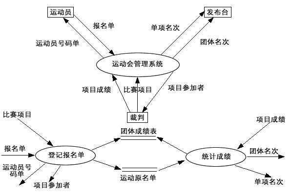

# 2011-2012学年第一学期软件工程B卷

> 考试方式：闭卷　　考试时间：120分钟　　卷面总分：100分

## 一、选择题（本题共15题，每题2分，共30分）

**1. 开发软件所需高成本和产品的低质量之间有着尖锐的矛盾，这种现象称做(        )。**
A. 软件工程      B. 软件周期      C. 软件危机      D. 软件产生

**2. 软件需求分析的主要任务是准确地定义出要开发的软件系统要(　  　)。**
A. 如何做      B. 做什么      C. 怎么做      D. 对谁做

**3. 快速原型模型的主要特点之一是(　  　)**
A. 开发完毕才见到产品      B. 及早提供全部完整的软件产品

C. 开发完毕后才见到工作软件      D. 及早提供工作软件

**4. 如果某种内聚要求一个模块中包含的任务必须在同一段时间内执行，则这种内聚为 (　   　 )。**
A. 时间内聚      B. 功能内聚      C. 信息内聚      D. 过程内聚

**5. 软件维护产生的副作用，是指(   　　)。**
A. 开发时的错误      B. 隐含的错误      C. 运行时误操作      D. 因修改软件而造成的错误

---

**6. （ 　  ）意味着一个操作在不同的类中可以有不同的实现方式。**
A. 多态性      B. 多继承      C. 类的复用      D. 封装

**7. DFD中的每个加工至少需要(　　)。**
A. 一个输入流      B. 一个输出流      C. 一个输入或输出流      D. 一个输入流和一个输出流

**8. 对象是OO方法的核心，对象的类型有多种，通常把例如汽车、轮船、房屋等等，称之为( 　　)**
A. 有形实体      B. 作用      C. 事件      D. 性能说明

**9. 黑盒测试在设计测试用例时，主要需要研究(　  )**
A. 详细设计说明      B. 需求规格说明与概要设计说明

C. 项目开发计划      D. 概要设计说明与详细设计说明

**10. 在各种不同的软件需求中，功能需求描述了用户使用产品必须要完成的任务，可以在用例模型或方案脚本中予以说明，（     ）是从各个角度对系统的约束和限制，反映了应用对软件系统质量和特性的额外要求。**
A. 业务需求      B. 功能要求      C. 非功能需求      D. 用户需求

---

**11. 汽车有一个发动机。汽车和发动机之间属于 (   )关系。**
A. 一般具体      B. 主从关系      C. 分类关系      D. 整体部分

**12. 维护活动必须应用于（   ）。**
A. 软件文档      B. 整个软件配置      C. 可执行代码      D. 数据

**13. 在软件维护工作中，如果对软件的修改只限制在原需求说明书的范围之内，这种维护是属于(      )**
A. 纠正性维护      B. 适应性维护      C. 完善性维护      D. 预防性维护

**14. 可行性分析是在系统开发的早期所做的一项重要的论证工作，它是决定该系统是否开发的决策依据，因必须给出（    ）的回答。**
A. 确定      B. 正确      C. 行或不行      D. 无二义

**15. 美国卡内基—梅隆大学SEI提出的CMM模型将软件过程的成熟度分为5个等级，以下选项中属于可管理级的特征是(      )。**
A. 工作无序，项目进行过程中经常放弃当初的计划      B. 建立了项目级的管理制度

C. 建立了企业级的管理制度      D. 软件过程中活动的生产率和质量是可度量的

## 二、简答题

1、请简述一下什么是软件生命周期，它有哪6个步骤？

---

2、请用流程图描述下列程序的算法：在数组A[1]-A[10]中求最大数？

---

3、软件维护的步骤有哪些？

---

## 三、判断题（本题共10小题，每题1分，共10分）

1、需求是变化的，软件是灵活的，总可以满足需求。        (     )

2、因为面向对象程序设计模式解决了抽象和重用，所以成为了当今的主流模式。（　）

3、模块的内聚程度最高的是功能内聚。                   （     ）

4、好的测试是用少量的测试用例运行程序，发现被测程序尽可能多的错误。（     ）

5、如果利用快速原型法进行开发，那么就不必进行需求分析。（     ）

---

6、度量程序复杂程度的目的是对该程序测试难度的一种估计。（     ）

7、解决软件危机的途径是按工程化的原则和方法进行软件开发。（     ）

8、一段可以运行的程序称之为软件。                       （     ）

9、面向对象的集成测试重点在于发现不同类之间的协作错误。（　   ）

10、 CMM能力成熟度模型只关注软件过程，不关注软件开发技术和人员问题，说明开发技术和人员问题并不重要。                （　）

## 四、填空题（本题共10空，每空2分，共20分）

1、使用         原型可以让用户更多、更早地参与需求分析过程。

2、从工程管理的角度看，软件设计可分为            和           两大步骤。

3、确认测试应检查软件能否按合同要求进行工作，即检查软件是否满足     的确认标准。

4、类之间的                 是现实世界中遗传关系的模拟，它表示类之间的内在联系以及对属性和方法的共享。

---

5、对象之间进行通信的构造叫做___   ____。

6、UML的类包含三个部分：类的名称、　       　、　　　  　。

7、为了便于对照检查，测试用例应由输入数据和预期的_      _____两部分组成。

8、将数据流图映射为程序结构时, 所用映射方法涉及信息流的类型。其信息流分为事物流和            两种类型。

## 五、简答题（本题共4小题，共20分）

1、什么是软件工程？什么是软件过程？（5分）

> 答：定义1：为了经济地获得可靠的且能在实际机器上有效地运行的软件，而建立和使用完善的工程原理。
>
> 定义2：软件工程是用科学知识和技术原理来定义、开发维护软件的一门科学。其主要思想是用工程的方法代替传统手工方法。这种工程化的思想贯穿到需求分析，设计，实现，直到维护的整个这程。
>
> 定义3：是研究和应用如何以系统性，规范化，可定量的方法去开发，操纵和维护软件，即把工程实践应用到软件上。
>
> 1993年IEEE软件工程定义:软件工程是(1)将系统化的、严格约束的、可量化的方法应用于软件的开发、运行和维护，即将工程化应用于软件。(2)在(1)中所述方法的研究。
>
> 软件过程是为了获得高质量软件所需要完成的一系列任务的框架，它规定了完成各项任务的工作步骤。描述了who、when、what、how，用以实现某一个特定的具体目标。定义了运用方法的顺序、应该交付的文档资料、管理措施和标识软件开发各个阶段任务完成的里程碑。

---

2、 简述软件配置管理的目标和基线的含义。（5分）

> 答：配置管理的含义：配置管理是一组管理整个软件生存期个阶段中变更的活动，标识变更、控制变更、确保变更能正确的实现、并报告有关变更情况，使变更所产生的错误最小并最有效地提高生产率。
>
> 基线的含义：基线是通过了正式复审的软件配置项，是软件生存期中各开发阶段的一个特定的检查点，使各阶段工作划分更加明确化。能够保证当基线发生错误时，可以知道其所处的位置，并返回到最近和最恰当的基线上。

---

3、软件总体结构设计的目标是什么？（5分）

> 答：产生一个模块化的程序结构并明确各模块之间的控制关系,此外还要通过定义界面,说明程序的输入输出数据流,进一步协调程序结构和数据结构。

---

4、面向对象程序设计语言最基本的机制包括哪些？（5分）

> 答：类、子类、对象和实例的定义，单继承和多继承，对象的部分—整体关系，消息传递和动态链接等等。

---

## 六、综合题（本题共2小题，共20分）

1、用SA方法画出下列问题的顶层和0层数据流图。（本题12分）

> 每个6分
>
> 

---

  某运动会管理系统接受来自运动员的报名单、裁判的比赛项目及项目成绩，产生运动员号码单发送给运动员，项目参加者发送给裁判，单项名次、团体名次发送给发布台。该系统有两部分功能：

  （1）登记报名单：接受报名单、比赛项目，产生运动员号码单、项目参加者，形成运动员名单及团体成绩表两种数据存储。

  （2）统计成绩：接受项目成绩，查询运动员名单，产生单项名次，填写团体成绩，最后产生团体名次。

2、根据你课程实践的经验，论述你参与分析和开发的项目概要和你所担任的工作（本题8分）。

> 无统一答案，酌情给分。

---

## 参考答案

一、单项选择题（本题共15题，每题2分，共30分）

1、C     2、B     3、D     4、A     5、D

6、A     7、D     8、A     9、B     10、C

11、D    12、B    13、C    14、C    15、D

二、判断题（本题共10小题，每题1分，共10分）

1—5：×、√、√、√、×

6—10：√、√、×、√、×

三、填空题（本题共10空，每空2分，共20分）

1、快速

2、概要设计， 详细设计

3、软件需求规格书

4、继承关系

5、消息

6、属性，方法

7、输出结果

8、变换流

四、简答题（本题共4小题，共20分，答对要点即得分）

1.答：定义1：为了经济地获得可靠的且能在实际机器上有效地运行的软件，而建立和使用完善的工程原理。

定义2：软件工程是用科学知识和技术原理来定义、开发维护软件的一门科学。其主要思想是用工程的方法代替传统手工方法。这种工程化的思想贯穿到需求分析，设计，实现，直到维护的整个这程。

定义3：是研究和应用如何以系统性，规范化，可定量的方法去开发，操纵和维护软件，即把工程实践应用到软件上。

1993年IEEE软件工程定义:软件工程是(1)将系统化的、严格约束的、可量化的方法应用于软件的开发、运行和维护，即将工程化应用于软件。(2)在(1)中所述方法的研究。

软件过程是为了获得高质量软件所需要完成的一系列任务的框架，它规定了完成各项任务的工作步骤。描述了who、when、what、how，用以实现某一个特定的具体目标。定义了运用方法的顺序、应该交付的文档资料、管理措施和标识软件开发各个阶段任务完成的里程碑。

2.答：配置管理的含义：配置管理是一组管理整个软件生存期个阶段中变更的活动，标识变更、控制变更、确保变更能正确的实现、并报告有关变更情况，使变更所产生的错误最小并最有效地提高生产率。

基线的含义：基线是通过了正式复审的软件配置项，是软件生存期中各开发阶段的一个特定的检查点，使各阶段工作划分更加明确化。能够保证当基线发生错误时，可以知道其所处的位置，并返回到最近和最恰当的基线上。

3.答：产生一个模块化的程序结构并明确各模块之间的控制关系,此外还要通过定义界面,说明程序的输入输出数据流,进一步协调程序结构和数据结构。

4.答：类、子类、对象和实例的定义，单继承和多继承，对象的部分—整体关系，消息传递和动态链接等等。

五、综合题（本题共2小题，共20分）

1.每个6分

2.无统一答案，酌情给分。
