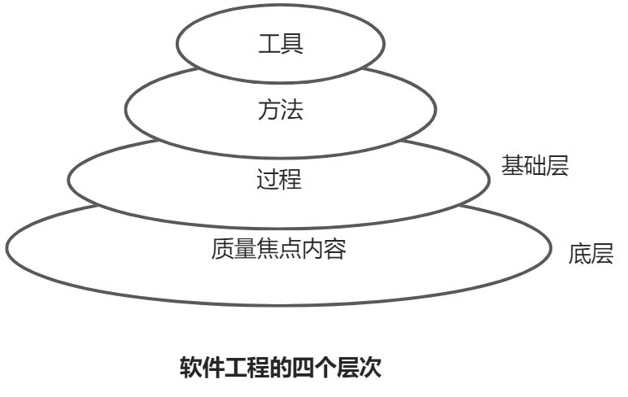
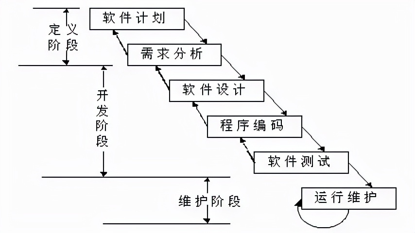
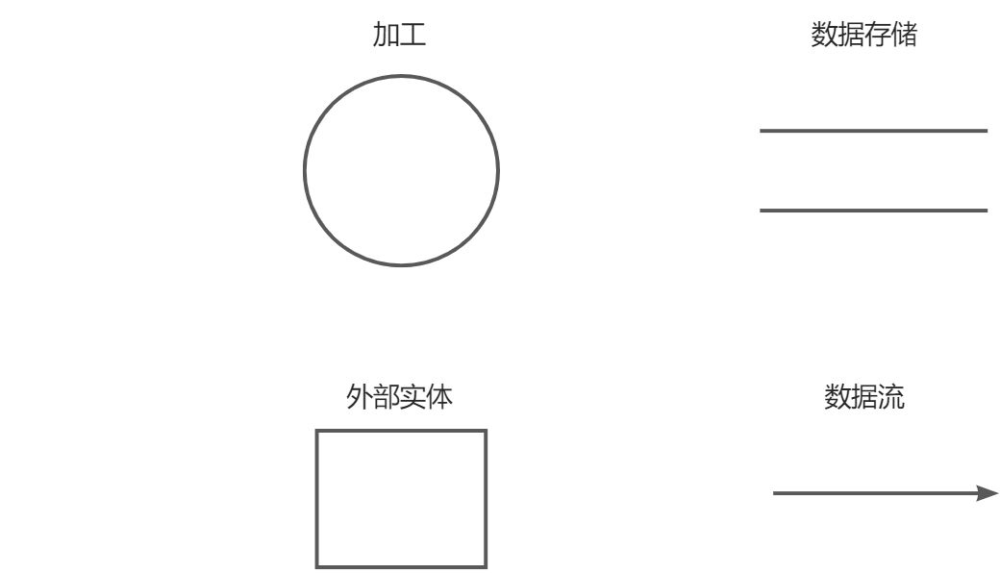

> 此文本为”语雀“笔记软件中复制过来的，很多序号的格式有点乱，凑合着看看。

> 💡 河南大学计算机与信息工程学院2023下半年期末考试
>
> 💡《软件工程》期末重点总结（自用）

**题型：**

- 选择题 10*2分
- 判断题 5*2分
- 简答题 5*6分
- 综合题 2*20分

> 💡 《软件工程》期末只占50%😊😊

## 一、知识点

### 第一章 软件工程概述

#### 1. 软件的定义

软件的定义：软件是计算机程序、规程以及运行计算机系统可能需要的相关文档和数据。

- **计算机程序**——计算机设备可以接受的一系列指令和说明，为计算机执行提供所需的功能和性能。
- **数据**——事实、概念和指令的结构化表示，能被计算机接收、理解或处理。
- **文档**——描述程序研制过程、方法及使用的图文材料。

`程序 = 算法 + 数据结构`

`软件 = 程序 + 文档 + 数据`

#### 2. 软件的特点

1. 软件和硬件不同，它不是看得见、摸得着的物理实体，而是一种逻辑实体，具有抽象性。
2. 软件是被开发或设计的，而不是传统意义上的被制造。
3. 软件不会磨损。
4. 目前软件的开发模式还没有完全脱离手工开发方式，大部分软件产品都属于“定制”类型，还不能完全采用组装的方式进行软件开发。
5. 软件本身非常复杂。
6. 软件成本相当昂贵。
7. 软件工作涉及社会因素。

**本质特性**：软件具有复杂度、一致性、可变性和不可见性等固有的内在特性，这是造成软件开发困难的根本原因。

#### 3. 软件危机

**软件危机的定义**：是指在计算机软件的开发和维护过程中所遇到的一系列严重问题。

**软件危机的表现**：

1. 对软件开发成本和进度的估计常常不准确。
2. 用户对“已完成”系统不满意的现象经常发生。
3. 软件产品的质量往往不能得到保证。
4. 软件的可维护程度非常低。
5. 软件通常没有适当的文档资料。
6. 软件成本在计算机系统总成本所占比例逐年上升。
7. 软件开发生产效率提高的速度，远远跟不上计算机应用迅速普及深入的趋势。

**软件工程学的一个重要目标是**：提高软件的可维护性。

#### 4. 软件工程三要素

- 过程
- 方法
- 工具

- **位于底层的质量焦点**内容表明软件工程要以质量为关注的焦点、重心，全面的质量管理和质量需求是促进软件过程不断改进的源动力。
- **软件工程的基础层是过程层**。软件工程过程是为获得软件产品，在软件工具支持下由软件开发人员完成的一系列软件工程的活动。
- **方法层**为软件开发的各个阶段提供所需的各种方法。
- **工具层**为软件工程方法提供了一种自动或半自动的软件支撑环境。

### 第二章 软件生命周期和过程模型

#### 1. 软件生命周期

1. **问题定义**：确定解决什么问题？
2. **可行性研究**：是否做？
   - **目的**：该软件项目是否应该做；
   - **对软件项目进行多个角度分析**：
     - **技术可行性**：当前技术能否完成该软件项目
     - **经济可行性**：该项目预估投入多少，能否带来收益
     - **操作可行性**：该项目是否界面友好，功能清晰，能够方便操作
     - **社会可行性**：是否符合法律法规，是否能够有益社会发展，短时间内不被淘汰
   - **工具**：数据流图、系统流程图
   - **产物**：最终将分析结果以可行性研究报告的形式展现。

3. **需求分析**：做什么？
   - **目的**：了解客户需求，明确客户对软件的功能需求和非功能需求。
   - **内容**：确定用户对软件项目的功能、性能、数据格式、界面的需求；
   - **工具**：建立逻辑模型、使用数据流图
   - **产物**：最终将用户需求用软件需求规格说明书的形式详细阐述。

4. **概要设计**：怎么做？（大概）
   - **目的**：完成对软件项目的大概设计。
   - **内容**：对软件项目的功能模块进行划分，接口、界面的完成
   - **产物**：概要设计说明书

5. **详细设计**：怎么做？（详细）
   - **目的**：完成对软件项目功能实现的详细做法。
   - **内容**：对功能模块的实现，细化到算法、数据结构的层次，详细的定义功能模块的实现。
   - **工具**：程序流程图、伪代码、PAD图
   - **产物**：详细设计说明书

6. **编码**：开始做
   - **目的**：根据详细设计说明书，选择程序设计语言，完成编码工作。
   - **产物**：源代码

7. **测试**：检查
   - **目的**：发现软件项目中尚未发现的问题。
   - **方法**：黑盒测试、白盒测试、灰盒测试
   - **产物**：测试分析报告

8. **运行与维护**：售后服务（占用精力和费用最多的阶段）
   - **目的**：根据软件运行中的问题，对其进行各种修改，使系统能持久地满足用户的需要。
   - **分类**：
     1. **纠错（改正）性维护**：诊断和改正正在使用过程中发现的软件错误。
     2. **适应性维护**：修改软件使之适应环境的变化。
     3. **完善性维护**：根据用户的新要求扩充功能和改进功能。
     4. **预防性维护**：修改软件为将来的维护活动预先准备。
   - **产物**：程序维护手册

#### 2. 软件过程模型

**软件过程模型**：软件开发全部过程、活动和任务的结构框架。明确地规定了要完成的主要活动、任务和开发策略。

**软件过程定义**：描述、开发、维护软件制品，创建、管理和支持软件项目的一系列活动和任务。

#### 3. 瀑布模型——线性顺序模型

- 从可行性研究开始，逐步进行阶段性变换，直至通过确认测试并得到用户确认的软件产品为止。
- 线性顺序模型
- 各个活动之间具有顺序性和依赖性。
- 是软件过程模型的里程碑。
- 包含各项软件工程活动：指定开发计划、进行需求分析、软件设计、程序编码、测试及运行维护。

- 采用结构化的分析和设计方法，将逻辑实现与物理实现分开。
- **特点**：
  1. 上一项活动接受该项活动的工作对象作为输入。
  2. 利用这一输入实施该项应完成的内容。
  3. 产生本项活动的相关产出，作为输出传给下一项活动。
  4. 对本项或活动执行情况进行评审，确认之后再转入下一阶段的工作，否则返工。

- **优点**：
  - 有利于大型软件开发过程中人员的组织、管理。
  - 有利于软件开发和工具的研究，从而提高了大型软件项目的质量和效率。

- **缺点**：
  - 客户往往很难清楚地给出全部需求，不能很好应对需求变化。
  - 软件的实际情况必须到项目开发后期客户才能看到，要求客户有足够的耐心。
  - 当阶段之间规定过多的文档时，会大大增加工作量，缺乏灵活性。
  - 开发过程一般不能逆转，否则代价太大。

- **使用范围**：
  - 用户的需求非常清楚全面，且在开发过程中没有或很少变化。
  - 开发人员对软件的应用领域很熟悉。
  - 用户的使用环境非常稳定。
  - 开发工作对用户参与的要求很低。

#### 4. 原型模型（演化模型）

- 快速确定用户需求，及早提供工作软件。
- 主要是根据事先不能完整定义需求的软件项目开发而言的。
- 当获得一组基本需求之后，通过快速分析构造出一个小型软件系统原型，以满足用户的基本要求。
- 不断构造、交付、使用、评价、反馈和修改，一轮一轮产生新的原型版本。
- 相对于瀑布模型来说，原型模型更符合人类认识真理的过程和思维。

- **优点**：
  - 开发人员和用户在“原型”上达成一致。减少设计中的错误和开发中的风险，也减少了对用户的培训时间，提高了系统的实用性、正确性以及用户的满意程度。
  - 缩短了开发周期，加快了工程进度。
  - 降低成本。

- **缺点**：
  - 准确的原型设计比较困难。
  - 客户与开发者对原型理解不同。
  - 不利于开发人员的创新。

- **使用范围**：
  - 对所开发的领域比较熟悉而且有快速的原型开发工具。
  - 项目招投标时，可以以原型模型作为软件的开发模型。
  - 进行产品移植或升级时，原型模式非常适合。

#### 5. 其他模型

1. **螺旋模型**——迭代思想
   - 强调风险分析
2. **喷泉模型**（迭代模型）
   - 按时间分批次交付
3. **增量模型**——迭代思想
   - 按模块分批次交付
4. **构建组装模型**（敏捷开发）——统一过程模型（RUP）——迭代思想

### 第三章 可行性研究

#### 1. 可行性研究

**任务**：以最小的代价在尽可能短的时间内确定问题是否能够解决。

**最终结果**：确定项目“做还是不做”而不是“如何做”。

- 技术可行性
- 经济可行性
- 操作可行性
- 社会可行性

### 第四章 需求工程

#### 1. 需求开发过程

1. **需求获取**：通过访谈、问卷调查、专题研讨会等手段获取用户需求。
2. **分析建模**：用清晰、简洁的方式将需求分析获得的信息记录下来，得到一个逻辑模型。
3. **编写规格说明书**：用户和开发人员都充分了解用户需求后，将共同的理解以规范化的形式准确的表达出来，形成需求规格说明书。
4. **需求评审**：在将需求交付设计之前，对需求规格说明书进行彻底的检查和修改。

#### 2. 需求变更控制

**步骤**：
1. 对提出的变更请求进行评审。
2. 由项目变更控制委员会或相关职能的类似组织对变更请求进行裁定。
3. 按照需求变更控制流程实施变更。

**原则**：
- 建立需求基线。
- 定义明确的需求变更控制流程。
- 变更后受影响的软件计划、产品、活动都要进行相应的变更，以保持和更新的需求一致。

### 第五章 结构化分析方法

#### 1. 结构化分析基本思想

- **基本原则**：“抽象与分解”
- **面向**“数据流”
- **结构化软件开发方法主要包括**：
  - 结构化分析（SA）
  - 结构化设计（SD）
  - 结构化编程（SP）

- 结构化分析方法主要以数据流分析作为需求分析的根本出发点，将任何信息处理的过程视为将输入数据转变为最终所输出信息的黑盒。
- **基本特征**：采用“数据流图”。
- **实质**：一种强烈依赖数据流的自顶向下的建模方法。

#### 2. 数据流图

- 反映了客观现实问题中的工作过程。
- **符号**：

- 数据流不能从外部实体直接流向外部实体，也不能从数据存储直接流向数据存储，也不能在外部实体和数据存储之间直接流动。
- 数据流至少有一个端点必须与数据处理符号连接。
- **数据流图的分层**：自顶向下，由外向里，逐层细化。

#### 3. 数据字典

- **最基本的功能**：数据定义
- **数据字典包含了五类条目**：
  - 数据项
  - 数据流
  - 加工逻辑
  - 数据存储
  - 外部实体

### 第七章 面向对象分析

#### 1. 交互的原则

实体类、边界类和控制类对象间的交互存在四个原则：

1. 用例的参与者只能与边界对象进行交互。
2. 边界对象只能与控制对象和用例的参与者进行交互。
3. 实体对象只能和控制对象进行交互。
4. 控制类对象可以和边界对象交互，也可以和实体对象交互，但不能和用例的参与者直接进行交互。

### 第八章 软件设计基础

#### 1. 软件设计

- **目的**：回答“系统应该如何做”这个问题。
- **模块的四个基本属性**：
  - **接口**：指模块的输入和输出。
  - **功能**：指该模块实现什么功能，做什么事情。
  - **逻辑**：描述模块内部怎么做。
  - **状态**：该模块使用时的环境和条件。

- 功能、逻辑和状态是三个基本要素。
- “高内聚，低耦合”
- **内聚性**：模块功能强度的度量
  - **高内聚**：功能内聚和顺序内聚
    - 功能内聚是内聚性最强的。
  - **中内聚**：通信内聚和过程内聚
  - **低内聚**：时间内聚、逻辑内聚和巧合内聚

- **耦合性**：模块之间的相对独立性的度量
  - 内容耦合是最高程度耦合，具有这种耦合性的模块独立性最弱，是应该避免的。

### 第十章 面向对象的设计

#### 1. 面向对象设计原则

- 单一职责原则
- **开放封闭原则**：
  - 软件实体类应该是可以扩展、但是不可修改的。
  - 软件应该对扩展开放，而对修改封闭 。
  - **基本思想**：不用修改原有类就能扩展一个类的行为。
- Liskov替换原则
- 接口隔离原则
- 依赖倒置原则

#### 2. 设计模式的作用和意义

1. 优化的设计经验
2. 极高的复用性
3. 丰富的表达能力
4. 极低的耦合度

### 第十三章 软件测试

#### 1. 软件测试概念

使用人工或自动手段来运行或测定某个系统的过程，检验它是否满足规定的需求或是弄清预期结果与实际结果之间的差别。

简单地说，软件测试就是为了发现软件缺陷。

#### 2. 软件测试技术

- **黑盒测试（功能性测试或行为测试）**
  - 完全不考虑程序的内部结构和处理过程，只知道软件应该具有的功能，通过测试检验每个功能是否都能正常使用。
- **白盒测试（透明盒测试）**
  - 已知产品内部工作过程，通过测试检验产品内部动作是否按照产品规格说明的规定正常进行。
- **静态测试**
  - 测试不运行的部分，只是静态检查和审核。
- **动态测试**
  - 使用和运行软件进行测试。

1. **静态黑盒测试——测试产品说明书**
   - 利用书面文档进行黑盒测试，认真查找其中的缺陷
   - 从两个方面进行检查：
     1. 高层次检查
     2. 低层次测试

2. **动态黑盒测试**
   - 不深入代码细节测试软件，程序在运行，边使用便测试。
   - 看不到具体代码和程序内部如何工作。
   - 测试软件正在使用过程中的实际行为。
   - 清楚地了解了被测试软件的输入和输出之后，接下来要开始定义测试用例。
   - 选择测试用例是软件测试员最重要的一项任务。
   - 动态黑盒测试主要包括两部分：
     1. 数据测试
     2. 状态测试

3. **静态白盒测试**
   - 在不执行软件的条件下有条理地审查软件设计、体系结构和代码，从而找出软件缺陷的过程，有时称为结构化分析。

4. **动态白盒测试**
   - 利用查看代码功能和实现方式得到的信息，确定哪些需要测试、哪些不需要测试以及如何展开测试。
   - 也称为结构化测试，因为软件测试员可以查看并使用代码的内部结构，从而设计和执行测试。
   - 动态白盒测试包括四部分：
     1. 分段测试——常用
     2. 数据覆盖
     3. 代码覆盖
        - 测试程序的状态以及程序流程，设法进入和退出每一个模块，执行每一行的代码，进入软件的每一条逻辑和决策分支。
          - 语句覆盖
          - 分支覆盖
          - 条件覆盖

#### 3. 软件测试策略

- 单元测试
- 集成测试
- 确认测试
- 系统测试

1. **单元测试（模块测试）**
   - 是针对软件设计的最小单元程序模块进行测试的工作。
   - 白盒测试法
   - 单元测试主要从五个方面进行：
     1. 模块接口测试
     2. 局部数据结构测试
     3. 路径测试
     4. 程序异常测试
     5. 边界条件测试
   - 为了进行单元测试必须编写测试驱动程序和桩程序。

2. **集成测试（组装测试）**
   - 按照一定的策略对单元测试的模块进行组装，并在组装过程中进行模块接口与系统功能测试。
   - 集成测试的策略主要有两种方式：
     1. 一次性组装方式
     2. 增殖式组装方式
        - 自顶向下增殖方式（不需要编写驱动程序，但需要桩程序）
        - 自底向上增殖方式（不需要编写桩程序，但需要驱动程序）

3. **确认测试（有效性测试）**
   - 验证软件的有效性，即验证软件的功能和性能及其它特性是否符合用户要求。
   - 软件的功能和性能要求参照软件需求说明书。
   - 黑盒测试法
   - α 测试：邀请用户参加在开发场地进行的测试。
   - β 测试：由部分用户在实际的使用环境中进行的测试。

4. **系统测试**
   - 测试软件系统是否能与硬件协调工作，测试与其他软件协调运行的情况。
   - 主要有以下几类系统测试：
     1. 恢复测试
     2. 安全测试
     3. 强度测试
     4. 性能测试

### 第十四章 软件维护

#### 1. 软件维护的分类

- **纠错（改正）性维护**
  - 开发阶段已发生而系统测试阶段尚未发现的错误（开发时候遇到的bug）。
- **适应性维护**
  - 软件适应信息技术变化和管理需求变化而进行的修改（旧功能适应新环境）。
- **完善性维护**——最主要的，占整个维护工作的一半
  - 在使用软件的过程中用户往往提出增加新功能或者修改已有的功能的建议（需要新功能） 。
- **预防性维护**
  - 为了改进未来的可维护性或者可靠性，或者为了给未来的改进奠定更好的基础而修改软件（为了以后未知的新功能）。

## 二、简答题（猜的）

### 1. 简述开放封闭原则。

1. 软件应该对扩展开放，而对修改封闭。
2. 在软件的生命周期内，需求变化是客观存在的且不以人的意志而转移，而对应的软件也必须做相应的变化。

### 2. 什么是白盒测试？什么是黑盒测试？⭐

**黑盒测试**，又称功能测试，是在不知道内部结构和工作原理的情况下进行的测试。在这种测试方法中，测试人员把应用程序看作一个黑盒子，只关注输入和输出的结果，而不考虑程序内部的状态。

**白盒测试**，又称结构测试，要求测试人员了解软件内部逻辑和结构。在这种测试方法中，测试人员把程序看成装在一个透明的白盒子里，不仅要检查输出结果，还需要检查程序的内部行为。

------

### 3. 比较面向对象开发方法相对于结构化开发方法的异同？⭐⭐

有个题目给出的答案：

1. **结构化开发方法**
   - 结构化方法的最大特点是面向功能分解问题。但由于处理与数据是分离的，并且在设计阶段与分析阶段采用不同的模型。
   - 简单、实用，适合于瀑布模型，易于开发者掌握，特别适合数据处理领域中的应用。

2. **面向对象开发方法**：
   - 面向对象方法以最稳定的对象与类系统作为考虑问题的出发点，通过不断反复、累增，逐步改进系统，从而更易获得符合用户需求、简单可靠、适应性强的系统。
   - 面向对象方法强调对象结构，而不是程序结构，从而解决了抽象与重用问题，成为当今的主流模式

**结构化方法的基本要点是**：自顶向下、逐步求精、模块化设计、结构化编码。

**面向对象开发方法要点**： 继承、多态和抽象。

------

### 4. 软件概要设计过程中应遵循的基本原理。

模块化、抽象、逐步求精、信息隐藏和局部化、模块独立。

------

### 5. 什么是软件生命周期？软件生命周期主要包含哪些阶段？各阶段的任务是？⭐⭐

**软件生命周期**： 软件从产生到报废的生命周期。

有个题目给出了答案：

软件生命周期一般包括分析、设计、实现、测试、维护阶段。

1. **分析阶段**：分析、整理和提炼所收集到的用户需求，建立完整的分析模型，将其编写成软件需求规格说明和初步的用户手册。
2. **设计阶段**：设计人员依据软件需求规格说明文档，确定软件的体系结构，进而确定每个模块的实现算法、数据结构和接口等，编写设计说明书，并组织进行设计评审。
3. **实现阶段**：将所设计的各个模块编写成计算机可接受的程序代码，与实现相关的文档就是源程序以及合适的注释。
4. **测试阶段**：在设计测试用例的基础上，测试软件的各个组成模块。然后将各个模块集成起来，测试整个产品的功能和性能是否满足已有的规格说明。
5. **维护阶段**：为了改正错误、适应环境变化和增强功能，对软件进行一系列的修订。

------

### 6. 什么是软件工程？什么是软件过程？⭐⭐⭐

**软件工程**：是用科学知识和技术原理来定义、开发维护软件的一门科学。其主要思想是用工程的方法代替传统手工方法。这种工程化的思想贯穿到需求分析，设计，实现，直到维护的整个过程。

**软件过程**：是为了获得高质量软件所需要完成的一系列任务的框架，它规定了完成各项任务的工作步骤。定义了运用方法的顺序、应该交付的文档资料、管理措施和表示软件开发各个阶段完成的里程碑。

------

### 7. 软件配置管理的目标和基线的含义。⭐⭐⭐

**配置管理**：配置管理是一组管理整个软件生存期各阶段中变更的活动，标识变更、控制变更、确保变更能正确地实现、并报告有关变更情况，使变更所产生的错误最小并最有效地提高生产率。

**基线**的含义：基线是通过了正式复审的软件配置项，是软件生存期中各开发阶段的一个特定的检查点，使各阶段工作划分更加明确化。能够保证当基线发生错误时，可以知道其所处的位置，并返回到最近和最恰当的基线上。

------

### 8. 软件危机的定义及表现？⭐⭐⭐

**软件危机的定义**：是指在计算机软件的开发和维护过程中所遇到的一系列严重问题。

**软件危机的表现**：

1. 对软件开发成本和进度的估计常常不准确。
2. 用户对“已完成”系统不满意的现象经常发生。
3. 软件产品的质量往往不能得到保证。
4. 软件的可维护程度非常低。
5. 软件通常没有适当的文档资料。
6. 软件成本在计算机系统总成本所占比例逐年上升。
7. 软件开发生产效率提高的速度，远远跟不上计算机应用迅速普及深入的趋势。

### 9. 需求开发的步骤⭐⭐⭐

1. **需求获取**：通过访谈、问卷调查、专题研讨会等手段获取用户需求。
2. **分析建模**：用清晰、简洁的方式将需求分析获得的信息记录下来，得到一个逻辑模型。
3. **编写规格说明书**：用户和开发人员都充分了解用户需求后，将共同的理解以规范化的形式准确的表达出来，形成需求规格说明书。
4. **需求评审**：在将需求交付设计之前，对需求规格说明书进行彻底的检查和修改。

------

### 10. 结构化开发方法和面向对象开发方法的基本思想分别是？⭐⭐⭐

**结构化方法**：把一个复杂问题的求解过程分阶段进行，而且这种分解是自顶向下，逐层分解，使得每个阶段处理的问题都控制在人们容易理解和处理的范围内。

**面向对象方法**：使用类、对象、继承、消息等基本概念进行程序设计。 将现实世界中具有相似属性和行为的事物抽象成程序中的对象。每个对象都拥有其自身的属性和方法，通过对象之间的交互实现系统的功能。

------

### 11. 对瀑布模型的理解及历史意义。⭐⭐⭐

- 采用结构化的分析和设计方法，将逻辑实现与物理实现分开。
- 包含各项软件工程活动：制定开发计划、进行需求分析、软件设计、程序编码、测试及运行维护。
- 以预见性为原则，以文档驱动开发过程，以过程控制为核心。
- **特点**：
  1. 上一项活动接受该项活动的工作对象作为输入。
  2. 利用这一输入实施该项应完成的内容。
  3. 产生本项活动的相关产出，作为输出传给下一项活动。
  4. 对本项活动执行情况进行评审，确认之后再转入下一阶段的工作，否则返工。

- **历史意义**：瀑布模型在软件工程中占有重要地位，它在软件发展的早期，为开发人员提供了一种开发的基本框架，有利于大型软件开发过程中人员的组织、管理，有利于软件的开发方法和工具的研究和使用，从而提高了大型软件项目开发的质量和效率。

## 三、综合题画图相关知识

### 1. 数据流图：

“[数据流图实例](https://blog.csdn.net/m0_73514832/article/details/135393460?spm=1001.2014.3001.5506)”

### 2. 用例图

看老师ppt吧

### 3. 系统结构图

“[系统结构图](https://blog.csdn.net/weixin_44663188/article/details/106461691?ops_request_misc=%257B%2522request%255Fid%2522%253A%2522170539876216777224454568%2522%252C%2522scm%2522%253A%252220140713.130102334..%2522%257D&request_id=170539876216777224454568&biz_id=0&utm_medium=distribute.pc_search_result.none-task-blog-2~all~top_positive~default-1-106461691-null-null.142%5Ev99%5Epc_search_result_base6&utm_term=%E7%B3%BB%E7%BB%9F%E7%BB%93%E6%9E%84%E5%9B%BE&spm=1018.2226.3001.4187)”